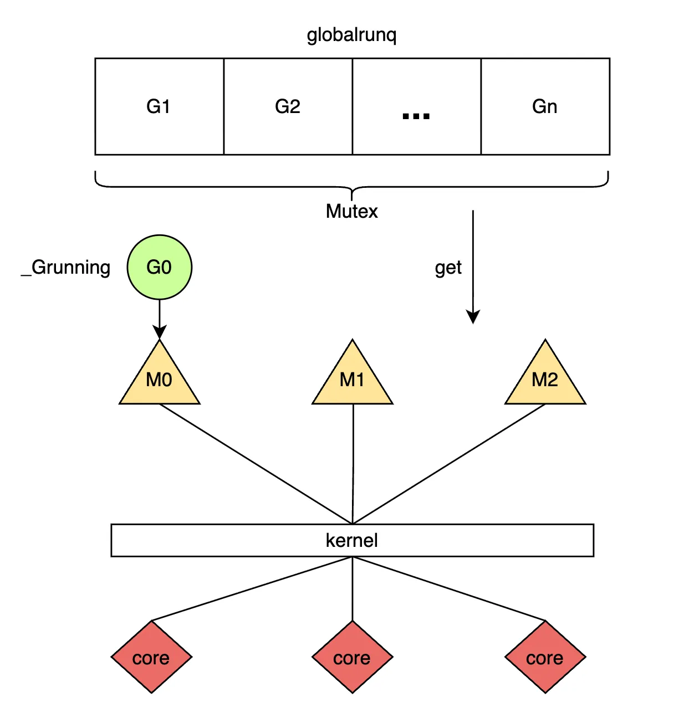
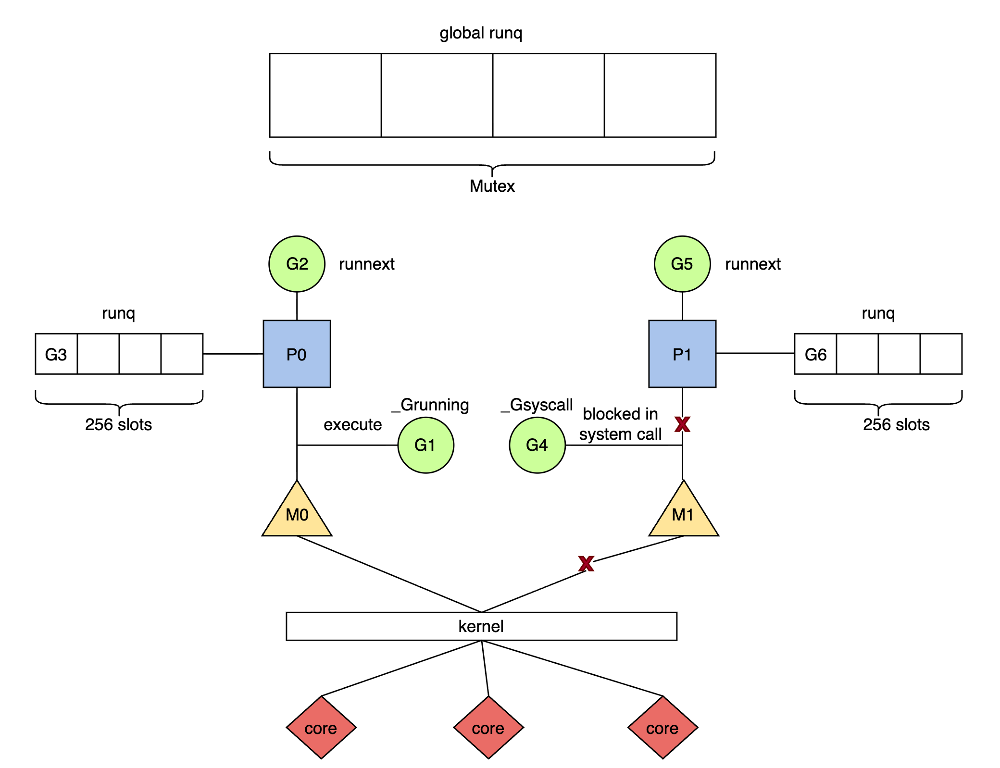
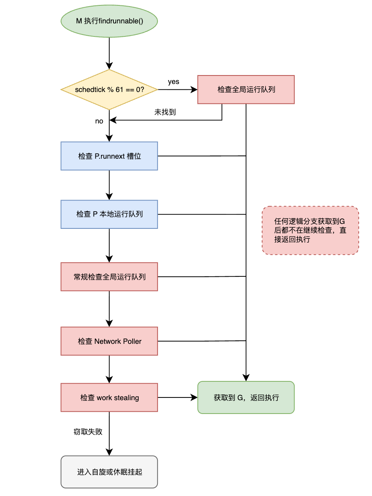

---
# 00. GMP 模型总览

## 1. 引言

go 引入 goroutine 的核心动力是为了解决多核系统下的高并发问题。传统的并发模型往往依赖于操作系统内核线程，但这种 1:1 的模型在高并发场景下面临显著的瓶颈：

* **内存开销大：** 线程栈通常固定在 1MB-8MB，若业务系统创建数以万计的线程，仅用于承载栈空间的内存将达到数十 GB。[^1]
* **上下文切换慢：** 系统级线程的调度强制依赖内核介入，引发用户空间与内核空间之间的硬件级上下文切换。该过程需全量保存与恢复 CPU 寄存器上下文并伴随缺页异常，调度延迟往往处于微秒（$\mu s$）量级。
* **应用态调度语义：** 通用的内核调度器（如Linux）无法感知应用层的并发语义差异（例如识别短生命周期任务或区分 I/O 密集型协程），难以实施针对性的微观调度策略。

为了解决上述问题，Go 设计了用户态线程——goroutine：

* **动态栈管理：** 初始栈仅为 2KB[^2]，并支持动态伸缩，单进程可轻松支撑数百万 goroutine。
* **廉价上下文切换：** 切换完全在用户态进行，操作仅局限于保存极少数必要寄存器，成本低至纳秒级。
* **非阻塞型 I/O 多路复用机制：** Runtime 抽象了操作系统底层的事件循环（如 epoll），提供了基于事件驱动的网络轮询器（Netpoller）。开发者得以采用“同步式书写，异步式运行”的编程范式，当发起网络调用时，M 不被阻塞，仅该 Goroutine 挂起。

---

## 2. 调度器架构演进

### 2.1 早期架构：GM 模型 (Go 1.x)

Go 调度器的早期实现版本基于原生的 M:N 调度模式，即通常所指的 GM 模型。在该模型中，系统核心包含了两个执行实体：

* **G (goroutine)：** 并发任务单元，承载函数指针与栈帧。
* **M (machine)：** 操作系统内核线程，执行实体。

**核心缺陷:**
所有的 G 都维护在一个**单一的全局运行队列** 中。M 获取任务必须竞争一把全局锁。随着 CPU 核心数增加，锁竞争极其激烈，导致性能急剧下降。GM模型示意如图1所示。

*图 1: GM 模型架构*

从如上的架构推演中可以明确发现：任何处于空闲态的物理线程（M）在试图获取下一个待执行的 G 或交还完成调度的 G 时，必须针对该全局运行队列的全局互斥锁（Mutex）执行加锁/解锁操作。 随着多核 CPU 架构的普及与系统并行度的提高，多线程对于单一全局锁的激烈竞争将引发极其严重的指令序列化与缓存一致性开销。此外，不同线程之间频繁地交互 G 也会显著破坏 CPU 的 L1/L2 缓存局部性。

### 2.2 当前架构：GMP 模型 (Go 1.1+)

Dmitry Vyukov 引入了第三个实体 **P (Processor)**，重构了调度链路。[^3]

* **P (Processor)：** 逻辑处理器，代表执行 Go 代码所需的资源上下文。

**GMP 模型实体关系：**

* **M 必须绑定 P** 才能执行 G。
* **P 拥有本地队列**，实现了无锁访问。

*图 2: GMP 模型架构：本地队列与 Syscall 分离机制*

**P 的引入解决了两大核心问题：**

1. **消除全局锁瓶颈：** M 的首要调度路径被定向到绑定 P 的本地运行队列。大部分 Goroutine 的生命周期闭环均能在本地节点完成，降低了全局锁竞争的概率。
2. **资源解耦与复用：** P 持有 mcache 等内存资源。当 M 因系统调用（Syscall）阻塞时，P 会与 M 分离，携带资源寻找新的 M 继续执行其他 G，避免了计算资源的浪费。

---

## 3. 核心调度机制

GMP 的核心不仅在于结构变化，更在于一套复杂的调度算法，旨在实现**高吞吐、低延迟与公平性**的平衡。

### 3.1 调度循环

M 在持有 P 的情况下，通过 `findrunnable` 函数执行调度循环[^4]。根据最新的 Runtime 逻辑，查找 G 的优先级顺序如下（结合图 3）：

1. **周期性检查全局队列：** 为了防止全局队列饥饿，每 **61** 次调度循环，强制优先检查一次全局队列。
2. **检查`runnext`结构：** 检查 P 的高优先级单槽位。
3. **检查本地队列：** 检查 P 的本地队列（无锁，最快路径）。
4. **常规检查本地队列：** 如果本地为空，常规检查全局队列。
5. **检查 Network Poller：** 检查是否有 I/O 就绪的 G。
6. **Work Stealing：** 尝试从其他 P 的本地队列窃取任务。

*图3: 调度器核心状态流转与优先级检查流程*

### 3.2 关键调度策略

#### 3.2.1 局部性优化：runnext

这是一种基于任务唤醒上下文的投递策略。当处于执行态的 $G_1$ 试图唤醒 $G_2$（典型场景为 Channel 的收发同步）时，系统调度器不再将 $G_2$ 抛入本地队列尾部，而是强行将其注入当前 P 的 `runnext` 槽位。 基于该策略，被唤醒的新逻辑单元将立即继承上层函数的执行时间片与 CPU 高速缓存。在流水线式计算等强局部性场景下，由于有效降低了 L1/L2 Cache 的失效概率，性能表现将取得跃迁式提升。
#### 3.2.2 Work Stealing 算法

在高度并行的分布式队列架构下，“部分 P 本地队列满载，而其他 P 队列处于空转态”的资源偏斜无法避免。为了纠偏，系统引入了 Work Stealing（工作窃取）算法。 当某个 M 探测到自身绑定的 P 队列出现持续性空转时，将启动随机探测机制，并主动从其他繁忙 P 的本地队列中成批窃取（通常取半）处于待处理状态的 G。该算法的博弈点在于：通过主动的系统级介入，以支付局部性丢失和轻量级锁的成本，换取全局物理核心计算力持续饱满，从而将系统延迟压制到最低限度。
#### 3.2.3 溢出规避与确定性边界

P 本地运行队列采用有限长数组的结构（物理上限为 256 槽位[^5]）。在遇到业务激增场景触发突发型 Goroutine 生成时，当本地队列达到容量极值，Runtime 强制要求将超出部分的 G 进行打包操作，并全量转储至系统的全局运行队列。该策略从原理上避免了单节点队列结构无限扩张引发的 OOM 故障。
#### 3.2.4 抢占式调度防御机制

缺乏中断机制的用户态调度系统极其容易出现 CPU 周期霸占现象。对此，Runtime 在其后台启动了独立且不依赖绑定 P 的 Sysmon 守护线程实施监控（阈值预设为 $10ms$）[^6]：

- **作式抢占：** 依赖于早期编译器预埋的代码探针。当 Sysmon 侦测到超时的 G 时，会强行将其 Goroutine Stack 边界指标清零。该 G 发生下一次函数级调用时，由于无法满足触发栈内溢出判定条件的基线要求，将不得不陷入 `morestack` 逻辑，进而将执行权归还给 Runtime。
- **信号级异步抢占 (Go 1.14+)：** 为化解纯循环或密集的数值计算无法触发函数调用这一问题，系统启用了内核级辅助机制。Sysmon 会直接向目标 M 发送进程间系统信号（如 POSIX 环境下的 `SIGURG`），接收到信号的 M 在强行转入内核信号处理程序的同时，被强制捕获并暂存寄存器状态，实现实质意义上的抢占与剥夺。
#### 3.2.5 自旋线程模型

* 当某 Goroutine 涉足 Socket I/O 阻塞时，控制流即时转交 Netpoller 队列。在此情境下，底层的系统级线程 M 并未随之陷入休眠态，而是能够即时抓取下一个就绪的 G 投入新一轮执行。 
- 同时，面临任务枯竭期，系统保留了被称为**自旋线程（Spinning Thread)** 机制的特定策略。那些暂时丧失运行目标的 M 被允许维持持续高强度的 CPU 空转侦测，而不会立刻被挂起降级。此举是为了下一次大批任务集中到达时，由系统内核唤醒成批休眠线程所需的微秒级巨大唤醒惩罚开销。

---

## 4. 总结

GMP 模型标志着 Go 语言对多核系统下并发模型的工程优良设计。凭借 `runnext` 的极度局部性偏好、分布式的 Work Stealing 再平衡、以及信号驱动式 Preemption，配合 Handoff 游离机制与非阻塞 Netpoller，这套调度系统在维持纳秒级任务切换的基础上，最终确立了具备确定性、超大吞吐量与极低延迟的现代并发调度框架标杆。

## 5. 参考

[^1]: [thred vs goroutine](https://dev.to/arundevs/goroutines-os-threads-and-the-go-scheduler-a-deep-dive-that-actually-makes-sense-1f9f)

[^2]: [min stack](https://github.com/golang/go/blob/release-branch.go1.24/src/runtime/stack.go#L75)

[^3]: [go schedule](https://docs.google.com/document/d/1TTj4T2JO42uD5ID9e89oa0sLKhJYD0Y_kqxDv3I3XMw/edit?tab=t.0#heading=h.mmq8lm48qfcw)

[^4]: [调度流程](https://github.com/golang/go/blob/release-branch.go1.24/src/runtime/proc.go#L3314)

[^5]: [p local runq](https://github.com/golang/go/blob/release-branch.go1.24/src/runtime/runtime2.go#L655)

[^6]: [抢占机制]( https://github.com/golang/go/blob/4d0658bb/src/runtime/preempt.go#L7-L19)
