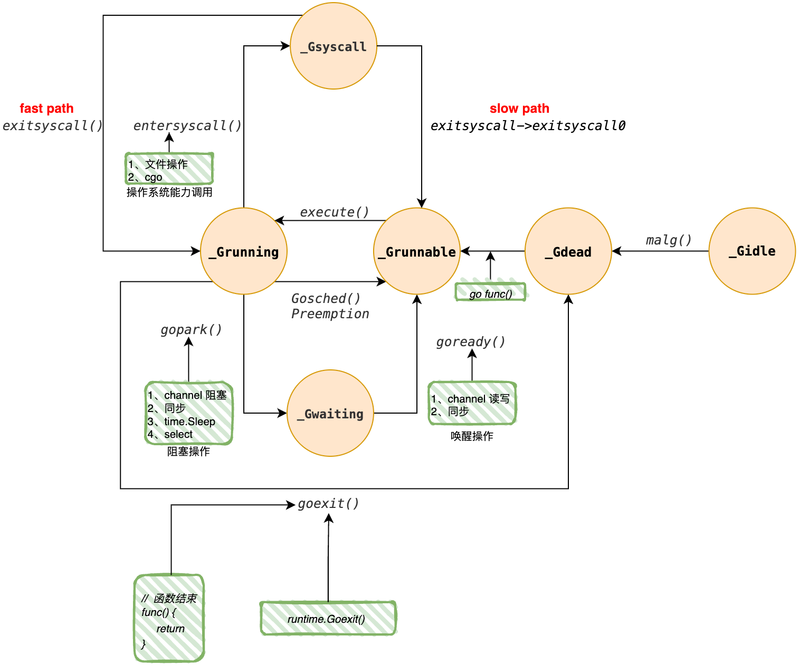

# 01. Goroutine(G)

!!! abstract "Abstract"
    **Keywords**: *Goroutine,  生命周期*

---

## 1. 核心结构

我们从 Goroutine 的源码及其核心状态开始分析，结合其整个生命周期的变换及 runtime 函数调用进行剖析。
### 1.1 源码

下面的代码片段基于 `go1.24.5` 版本，展示了 `g` 结构体中与调度息息相关的关键字段。

```go
type g struct {
    stack        stack         // 栈内存范围 [stack.lo, stack.hi)
    stackguard0  uintptr       // 关键字段：用于栈溢出检测和基于信号的抢占调度
    stackguard1  uintptr       // 用于 C 栈（系统调用/CGO 场景下的栈溢出检测）
    m            *m            // 当前绑定执行该 G 的系统线程 M
    sched        gobuf         // 上下文保存核心 (SP, PC, BP 等)
    atomicstatus atomic.Uint32 // 原子操作的生命周期状态
    preempt      bool          // 协作式抢占标志位（与 stackguard0 联动）
    preemptStop  bool          // 异步抢占时，是否将 G 迁移至 _Gpreempted 而非 _Grunnable
    _panic       *_panic       // 当前 G 的 panic 链表
    _defer       *_defer       // 当前 G 的 defer 链表
    goid         uint64        // Goroutine 的唯一标识
    // ... 其他字段
}
```

### 1.2 成员说明
#### stack

`stack` 字段描述了 Goroutine 的执行栈内存范围。这是 Goroutine 与操作系统线程（Thread）的重要区别之一：Goroutine 的栈初始大小仅为 **2KB**，但支持**动态扩容**。`lo` 和 `hi` 分别记录了当前栈空间的低地址和高地址边界。

```go
type stack struct {
    lo uintptr
    hi uintptr
}
```

栈的扩容上限由 `runtime/debug.SetMaxStack` 控制，64 位系统默认为 **1GB**。当函数调用链过深触达上限时，Runtime 会抛出 `stack overflow` 而非无限扩容。
#### stackguard0与stackguard1

这是一个具备**双重用途**的关键字段，直接参与 Go 的协作式调度与栈管理：

- **栈溢出检测**：Go 编译器会在每个（非叶子）函数头部插入 prologue 检查指令，比较当前栈指针（SP）与 `stackguard0`。若 `SP < stackguard0`，说明栈空间即将耗尽，触发 `runtime.morestack` 进行栈扩容。正常情况下 `stackguard0 = stack.lo + StackGuard`，提供了一段缓冲区。
- **协作式抢占**：当 sysmon 发现某个 G 运行时间过长时，会将其 `preempt` 标志位置为 `true`，并同时将 `stackguard0` 设置为特殊哨兵值 `stackPreempt`（`0xFFFFFFFFFFFFFFFE`，一个极大值）。这样，该 G 下次执行函数调用时，`SP < stackguard0` 的检查必然触发，G 会"主动"让出 CPU。这是 Go 1.14 之前的**唯一**抢占手段，对于不含函数调用的纯计算循环（如 `for {}`）无效。

`stackguard1` 的作用与 `stackguard0` 类似，但服务于 **C 栈**（CGO 调用或 `runtime.systemstack` 场景），使用 `runtime.morestack` 的 C 路径进行处理。
#### preempt 与 preemptStop

这两个布尔字段是 Go **1.14 引入的异步抢占**机制的组成部分：
- `preempt`：标记该 G 已被 sysmon 标记为应当被抢占。
- `preemptStop`：控制抢占后的目标状态。若为 `true`，G 将被挂起为 `_Gpreempted`（在安全点暂停，等待 GC 或调度器处理）；若为 `false`，则直接转为 `_Grunnable` 并放入全局运行队列，立即参与竞争调度。
#### m

代表当前的 **Machine**。在 GMP 模型中，G 必须绑定到 P，然后由 M 来驱动执行。

- 该字段指向当前正在运行该 G 的 M。
- 当 G 被放回队列（如 `_Grunnable`）或进入阻塞时，该字段通常会被置空或更新，标志着 G 与 M 的解绑。
#### sched(gobuf)

这是**上下文切换**的数据载体。`gobuf`结构体用于保存 CPU 的寄存器状态，以便“恢复现场”：

```go
type gobuf struct {
    sp   uintptr    // 栈顶指针，恢复函数调用帧
    pc   uintptr    // 程序计数器，下一条指令地址
    g    guintptr   // 反向持有对应的 G，用于一致性校验
    ctxt unsafe.Pointer // 闭包上下文
    ret  uintptr    // 系统调用或函数调用的返回值暂存
    lr   uintptr    // ARM 平台的链接寄存器（Link Register）
	bp   uintptr    // 栈基址指针，辅助 frame  pointer 展开
}
```

当 G 被暂停（例如 `gopark` 挂起或被抢占）时，当前的寄存器值会被保存到 `sched` 中；当 G 被再次选中调度时，Runtime 会通过`gogo(&g.sched)` 汇编函数将这些值加载回 CPU 寄存器。
#### atomicstatus

记录 Goroutine 的生命周期状态，使用 `atomic.Uint32` 保证并发修改的原子性。所有的状态变更都通过 `casgstatus` 函数进行，该函数内部以 CAS 操作实现，并在状态不合法时 panic，是调度器正确性的重要保障。_(具体状态定义见下文"生命周期"章节)_
#### goid

Goroutine 的唯一标识符。

- **注意**：Go 官方未暴露获取 goid 的 Public API，旨在防止开发者滥用 **GLS (Goroutine Local Storage)** 模式，鼓励使用 `context.Context` 进行隐式参数传递。在 Runtime 内部的追踪（Trace/pprof）和 panic 栈信息中，它是区分 G 的关键索引。

---

## 2. 生命周期

Goroutine 的生命周期由 `atomicstatus` 字段记录，其核心流转逻辑如图1所示：

*图 1: Goroutine 状态流转图*

以下是各状态的深度解析：

### `_Gidle` (空闲/未初始化)

G 被分配了内存但尚未初始化的状态。Runtime 在 `newproc` 中调用 `malg` 申请新 G 时，G 短暂处于此状态，随即被 `casgstatus` 流转至 `_Gdead` 进行初始化。
### `_Gdead` (死亡/可复用)

G 已完成执行或刚被初始化清理后的状态。

- **复用机制**：处于此状态的 G 会被缓存在 P 的本地 `gFree` 列表或全局 `sched.gFree` 列表中。
- **触发点**：当用户调用 `go func()` 时，Runtime（`newproc1`）会**优先**从 P 的本地 `gFree` 中取出一个 `_Gdead` 的 G 进行复用，将其栈、状态等重置后转为 `_Grunnable`，仅当 `gFree` 为空时才调用 `malg` 申请新内存。
- **意义**：高频 Goroutine 创建（如每个 HTTP 请求新建一个 G）的实际代价是极低成本的**状态重置**，而非昂贵的堆内存分配与 GC 压力。

### `_Grunnable` (就绪态)

G 已经准备好运行，正在等待被调度。

- **位置**：可能处于 **P 的本地运行队列（Local Run Queue）**、**`runnext` 高优先级插队槽位**，或**全局运行队列（Global Run Queue）** 中。
- **优先级**：调度器在每轮 `schedule()` 中，首先检查 `runnext`，其次消费本地队列，约每 61 次调度才会检查一次全局队列（`schedtick % 61 == 0`），以防止全局队列中的 G 被"饿死"。
- **转换**：一旦调度器（M）选中它，G 与 M 绑定并转换为 `_Grunning`。

### `_Grunning` (运行态)

G 正在 M 上执行用户态代码。这是实际消耗 CPU 的阶段。从该状态出发的转换路径最为复杂：

1. **用户态阻塞 (To `_Gwaiting`)**
    - **场景**：Channel 读写、Mutex 加锁、`time.Sleep`、Select 等待、网络 I/O。
    - **机制**：通过 `gopark(unlockf, ...)` 实现。`gopark` 将 G 的状态置为 `_Gwaiting`，同时将 G 挂载到对应的等待数据结构（如 `hchan.recvq`），随后调用 `schedule()` 让 M 去执行其他 G。
    - **关键点**：此时 **M 不阻塞**，CPU 保持满负荷运转，这是 Go 高并发的核心优势。
2. **系统调用 (To `_Gsyscall`)**
    - **场景**：文件 I/O、网络 syscall（非 netpoller 覆盖的路径）、CGO 调用。
    - **机制**：通过 `entersyscall` 进入，记录快照并解绑 P（`releasep`），M 陷入内核态等待。
    - **关键点**：为了避免 P 闲置，P 会与 M 分离，转而交由其他 M 接管。
3. **被抢占 (To `_Grunnable`或`_Gpreempted`)**
    - **协作式抢占**：`runtime.Gosched()` 主动让出，或函数调用时检测到 `stackguard0 == stackPreempt`，G 被放入**全局运行队列**（`_Grunnable`）。
	- **异步抢占（Go 1.14+）**：sysmon 检测到 G 运行超过 10ms，向其所在 M 发送 `SIGURG` 信号。M 的信号处理函数 `sighandler` 调用 `doSigPreempt`，后者将信号上下文的 PC 修改为指向 `runtime.asyncPreempt` 汇编函数的地址。M 从信号处理返回后，即跳转至 `asyncPreempt`，该函数保存所有调用者寄存器后调用 `asyncPreempt2`：
	    - 若 `preemptStop == true`（通常由 STW/GC 触发）：调用 `mcall(preemptPark)` 将 G 挂起为 **`_Gpreempted`**，等待 GC 完成后由 `resumeG` 恢复。
	    - 若 `preemptStop == false`（调度器主动抢占）：调用 `gopreempt_m → goschedImpl`，将 G 置为 **`_Grunnable`** 并放入全局队列，M 继续 `schedule()`。
4. **执行结束 (To `_Gdead`)**
    - **场景**：Goroutine 函数体 `return` 或调用 `runtime.Goexit()`（后者会先执行所有 `defer`）。
    - **机制**：通过 `goexit0` 清理 G 的各字段，将其放入 P 的 `gFree` 列表，等待复用。

### `_Gwaiting` (等待态)

G 处于用户态阻塞，M 活跃并继续执行其他任务。Runtime 将 G 通过 `sudog` 等中间结构挂载到特定等待队列，直到条件满足时通过 `goready` 唤醒为 `_Grunnable`：

| 阻塞原因        | 等待数据结构                             | 中间层        | 唤醒触发方                         |
| ----------- | ---------------------------------- | ---------- | ----------------------------- |
| **Channel** | `hchan.recvq` / `hchan.sendq`      | `sudog`    | 对端 send/recv，或 `close(ch)`    |
| **Mutex**   | `semaRoot`（全局信号量二叉树）               | `sudog`    | `sync.Mutex.Unlock`           |
| **Sleep**   | `P.timers`（四叉堆，最小堆语义）              | `timer`    | sysmon 或 timerproc 触发         |
| **Net I/O** | Netpoller（`epoll`/`kqueue`/`IOCP`） | `pollDesc` | `netpoll` 由 `findRunnable` 轮询 |
| **Select**  | 所有涉及 Channel 的 `recvq`/`sendq`     | `sudog` 列表 | 第一个就绪的 Channel case           |
| **GC Wait** | `gcBgMarkWorker` 等待通知              | —          | GC 控制器                        |

### `_Gsyscall` (系统调用)

当 G 调用底层操作系统接口（如磁盘 I/O）时进入此状态。Runtime 对此进行了极致优化：

1. **Fast Path (乐观返回)**
    - **场景**：系统调用极短暂（Sysmon 尚未介入，P 未被剥离）。
	- **流程**：`exitsyscall` 发现原来的 P 仍处于 `_Psyscall` 状态，调用 `wirep` 重新绑定。
	- **结果**：G 直接恢复 `_Grunning`，**无任何调度开销**，与普通函数调用几乎等价。
	
2. **Slow Path (悲观排队)**
    - **场景**：系统调用超过 sysmon 轮询周期（约 10~20ms），sysmon 调用 `retake` 将 P 的状态改为 `_Pidle` 并强制剥离，交给其他 M。
	- **流程**：M 从内核返回后，`exitsyscall` 发现原 P 已被抢走，尝试从 idle P 列表中抢一个新 P。
	    - **抢到 P**：重新绑定，G 恢复为 `_Grunning`。
	    - **未抢到 P**：将 G 放入**全局运行队列**（`_Grunnable`），M 解绑并进入休眠（`stopm`）。

### `_Gpreempted`（异步抢占挂起态，Go 1.14+）

这是 Go 1.14 引入异步抢占机制时新增的状态，专门用于 **STW（Stop-The-World）** 和 GC 场景中的精确抢占：

- **触发路径**：sysmon 或 GC 将 G 的 `preemptStop` 设为 `true` 后，发送 SIGURG 信号触发 `asyncPreempt`，最终调用 `preemptPark`，将 G 原子地置为 `_Gpreempted` 并解绑 M。
- **与 `_Grunnable` 的区别**：`_Gpreempted` 的 G 不会进入运行队列，而是**原地等待**，直到 `resumeG` 被调用（通常是 STW 结束或 GC 完成后）才重新变为 `_Grunnable`。
- **意义**：使 GC 的安全点扫描更加准确和高效，是实现**低延迟 GC** 的关键基础。

---
## 3. 关键调度原语

理解状态流转后，我们需要深入两个贯穿整个调度系统的核心函数。

### 3.1 gopark —— 主动让出

```
gopark(unlockf, lock, reason, traceEv, traceskip)
    └─ acquirem()               // 禁止当前 M 被抢占
    └─ casgstatus(gp, _Grunning, _Gwaiting)
    └─ unlockf(gp, lock)        // 原子释放关联锁（如 hchan.lock）
    └─ schedule()               // M 进入新一轮调度，寻找下一个 G
```

`unlockf` 的设计至关重要：它在 G 状态变为 `_Gwaiting` 后、且 M 彻底离开该 G 之前被调用，确保唤醒者（如 Channel 的 send 操作）在看到锁释放时，G 必然已处于可安全操作的 `_Gwaiting` 状态，从而避免唤醒信号丢失的竞态。

### 3.2 goready —— 唤醒就绪

```
goready(gp, traceskip)
    └─ casgstatus(gp, _Gwaiting, _Grunnable)
    └─ runqput(p, gp, next=true) // 优先放入当前 P 的 runnext 槽，保证局部性
```

`goready` 通常在持有相关锁的情况下被调用（如 Channel 的 send/recv 路径），将 G 从等待队列摘除并设为 `_Grunnable`，放入 `runnext` 以优先在本地 P 上快速执行，减少跨 P 迁移和缓存失效。

## 4. 总结

通过对 `g` 结构体及其完整生命周期的分析，我们可以提炼出 Go 调度器（GMP）实现**高吞吐、低延迟**的三大核心设计哲学：

### 4.1 资源复用与轻量级

- **栈内存**：从 2KB 开始按需扩缩容，远小于线程的 MB 级别栈，支撑了百万级并发的可行性。
- **对象池化**：`_Gdead` 状态配合 P 本地 `gFree` 列表的存在，使 G 并非一次性资源。高频的 Goroutine 创建与销毁（如 HTTP Server 为每个请求创建 G）实际上是极低成本的**状态重置与栈复用**，而非昂贵的内存分配。

### 4.2 M 与 G 的阻塞解耦

- **用户态阻塞（`_Gwaiting`）**：Channel、锁、网络 I/O 等逻辑层面的等待，被转换为 Runtime 内部数据结构（`sudog`、`pollDesc`、`timer`）的挂载。**G 停工，但 M 不停工**，CPU 核心始终在全速处理计算任务，这是 Go 相比传统同步 I/O 模型（一请求一线程）的根本优势。
- **内核态阻塞（`_Gsyscall`）**：对于无法代理的系统调用阻塞，Go 采用"超时剥离（Handoff）"策略。Fast Path 保证了短调用的零开销亲和性，Slow Path 则防止长调用导致 P 闲置，二者协同实现了 CPU 利用率的最大化。

### 4.3 协作与抢占的平衡

Go 的抢占机制经历了从**协作式**到**混合式**的演进：

|版本|机制|原理|局限|
|---|---|---|---|
|< 1.14|协作式|函数调用时检查 `stackguard0`|纯计算循环无法被抢占，可能导致 STW 延迟过高|
|≥ 1.14|协作式 + 异步信号式|`SIGURG` + `asyncPreempt`|接近无盲区，极少数 unsafe 场景除外|

`stackguard0` 机制在保护栈安全的同时，也为协作式调度提供了低开销的检查点。而基于 `SIGURG` 的异步抢占则填补了纯计算循环的漏洞，引入 `_Gpreempted` 状态更是为 GC 的精确安全点扫描提供了保障，从根本上消除了"饥饿"现象，保证了**全局调度公平性**。

综上所述，Goroutine 不仅仅是一个轻量级线程，它是一个**拥有独立栈、独立状态机、且被 Runtime 深度管理的执行单元**。理解其状态机的每一个节点与转换边，是深入理解 Go 高性能并发模型的必要基础。开发者可以用同步的代码逻辑（如阻塞 `Read`），享受到异步非阻塞的高性能语义——这正是 Goroutine 设计哲学的精髓所在。
