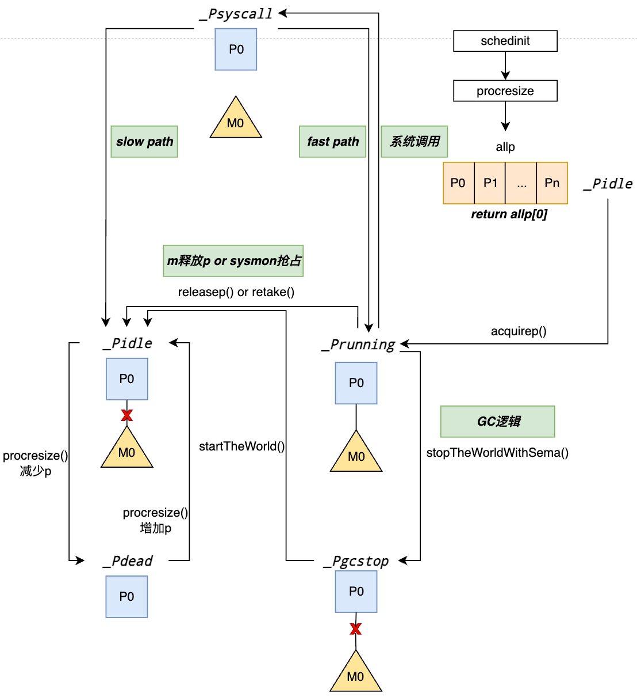

# 03. Processor(P) 

!!! abstract "Abstract" 
	**Keywords**: _GMP模型, 本地运行队列, 上下文切换, M:N调度, Work Stealing, 内存亲和性_

## 1. 核心结构

P 代表 **Processor**（逻辑处理器）。它的数量决定了 Go 程序的**最大并行度**（由 `GOMAXPROCS` 决定）。P 是 GMP 模型中的核心资源管理者，它维护了 M 执行 G 所需的上下文环境，如本地任务队列、内存分配缓存等。

### 1.1 源码核心字段

下面的代码片段基于 Go 1.24+ 版本，筛选了 `p` 结构中最核心字段（完整结构见 [runtime2.go](https://github.com/golang/go/blob/master/src/runtime/runtime2.go)）：

```go
type p struct {
    id          int32
    status      uint32 // P 的状态 (如 _Pidle, _Prunning)
    link        puintptr // 链表指针，用于管理空闲 P (sched.pidle)
    
    // 绑定关系
    m           muintptr   // 回指当前绑定该 P 的 M (如果是空闲 P 则为 nil)
    mcache      *mcache    // 核心：P 本地的内存缓存 (分配微对象无锁)
    
    // 调度队列 (无锁/低锁访问)
    // P 的本地 Runnable G 队列，支持无锁入队/出队
    runqhead    uint32
    runqtail    uint32
    runq        [256]guintptr
    
    // 极速插队槽
    // 指向下一个优先执行的 G。当 G1 创建 G2 时，G2 会被放入这里，
    // 以实现极高的调度亲和性 (Locality)。
    runnext     guintptr 

    // 复用池
    // 本地空闲 G 列表 (对象池)，避免从全局 gFree 加锁获取
    gFree struct {
        gList
        n int32
    }

    // 系统监控与管理
    sysmontick  sysmontick // 记录调度 tick，用于 sysmon 检测抢占
    timers      *timers    // ⚡️ 1.14+ 优化：P 本地管理的定时器堆
    
    // ... 其他字段 (GC 相关, 抢占相关等)
}
```

### 1.2 核心字段解析

#### 1. `runq` (本地运行队列)

这是 GMP 模型性能提升的关键。

- **结构**：一个固定容量（256）的环形数组。
- **机制**：当 M 持有这个 P 时，从 `runq` 获取 G 是**无锁**的（或使用极轻量的原子操作 CAS），这彻底消除了旧版 GM 模型中全局队列锁的巨大开销。

#### 2. `mcache` (本地内存缓存)

这是 Go 内存分配极快的原因。

- **机制**：每个 P 都有一个独立的 `mcache`。当 G 需要分配小对象（<32KB）时，直接从当前 P 的 `mcache` 中拿，**完全不需要加锁**。
- **意义**：将内存分配与 P 绑定，而不是与 M 绑定，是因为 M 可能会阻塞或休眠，而 P 始终是活跃的资源。

#### 3. `runnext` (高优先级插槽)

- **作用**：这是一个容量为 1 的“VIP 通道”。
- **场景**：当 `G1` 创建了 `G2`，Runtime 会倾向于把 `G2` 放入 `runnext` 而不是队尾。
- **原理**：通常 `G2` 会使用 `G1` 刚刚处理过的数据（CPU Cache 是热的），立即执行 `G2` 可以大幅提升缓存命中率。

---

## 2. 核心机制、状态及生命周期

P 的设计哲学是 **“资源化”**。它像 CPU 核心一样，是 M 执行代码必须争抢的凭证。

### 2.1 P 的生命周期

P 的生命周期与程序运行过程紧密相关，且比较稳定，核心状态变换及流程如下图所示：


*图1: p的生命周期及流转*

1. **创建**：
    - 程序启动时，Runtime 会根据 `GOMAXPROCS`（默认为 CPU 核数）创建所有的 P，并存储在全局变量 `allp` 切片中。
2. **重置**：
    - 如果在运行时调用 `runtime.GOMAXPROCS(n)` 修改了数量：
        - **增加**：创建新的 P，加入 `allp`。
        - **减少**：多余的 P 会被置为 `_Pdead`，释放其资源，剩下的 G 转移到全局队列。
3. **销毁**：
    - P 几乎不会被销毁，除非程序结束或 `GOMAXPROCS` 调小。
4. **系统调用**：当g的逻辑涉及到系统调用时，p会被置为`_Psyscall`状态，并同其绑定的m分离，
	- ***fast path***: 假如m较快的返回，其会继续同m绑定并返回`_Prunning`状态；
	- ***slow path:*** 假如m阻塞时间太长p会同m分离并进入`_Pidle`状态，等待其他m的绑定。
5. **GC**: runtime在垃圾回收的过程中需要暂停m的运行，m会主动释放p，p置为`_Pgcstop`状态，当垃圾回收结束，p会置为`_Pidle`状态一旦其被m绑定会迅速进入`_Prunning`状态。 

P 的状态决定了它是否可用，以及它当前归谁管，下表的信息对P的状态和对应的特征进行了总结，见表1。

| **状态**          | **含义**    | **行为特征**                                                              |
| --------------- | --------- | --------------------------------------------------------------------- |
| **`_Pidle`**    | **空闲**    | 位于全局空闲列表 `sched.pidle` 中。没有绑定 M，等待被 M (acquirep) 获取。                  |
| **`_Prunning`** | **运行中**   | 已经被某个 M 独占绑定。M 正在用它执行 G 或调度逻辑。                                        |
| **`_Psyscall`** | **系统调用**  | M 拿着它陷入了系统调用。**关键点**：此时 P 依然保留部分上下文（如 mcache），但它的 `runq` 可能会被其他 P 偷走。 |
| **`_Pgcstop`**  | **GC 停止** | 被 STW (Stop The World) 暂停。当前 P 里的 G 停止运行，等待 GC 完成。                    |
| **`_Pdead`**    | **已死亡**   | `GOMAXPROCS` 减少后，多余的 P 进入此状态，不再被使用。                                   |
*表1: p的状态及特征*

### 2.2 关键机制

#### 2.1 工作窃取

我们在前文中多次提到了工作窃取机制，由于该机制是不同p之间的交互逻辑，所以这里详细介绍下p的表现及窃取的过程，图2展示了p是如何进行work steal的。

*图2: p的work steal机制*

1. **查**：看 `runnext` 和 `runq`（空）。
2. **找**：看全局队列（空）。
3. **偷**：随机选一个 victim P，从它的 `runq` 头部偷走 **一半** 的 G。

**窃取目标的随机性算法：** Runtime 采用了 `victim = (start + i * step) % nprocs` 算法来选取目标 P。

- **start**: 随机起点。
- **step**: 与 P 总数互质的步长。

保证了遍历的伪随机性，同时确保能不重不漏地扫描所有 P，避免了全局锁竞争。多 P 竞争示意图如图3所示。

*图3: work steal竞争详细机制* 

#### 2.2 切换机制 (Handoff P)

这是处理阻塞调用的核心。

- **Fast Path**：M 进行短时间的 syscall，P 保持 `_Psyscall` 状态，M 回来直接用。
- **Slow Path**：sysmon 发现 M 阻塞太久，将 P 的状态改为 `_Pidle` 并剥离（Retake）。新的 M 可以获取这个 P，继续执行 P 队列里剩余的 G。**这保证了单个 M 的阻塞不会导致整个 P 队列的停滞。**
⚠️：我翻看了[_Psyscall in go 1.26](https://github.com/golang/go/blob/go1.26rc1/src/runtime/runtime2.go#L146)的逻辑，`_Psyscall`的定义已经废弃，详细见源码分析。

#### 2.3 局部性

在之前的GMP模型中我们详细介绍过p的引入是在很大程度上解决全局资源竞争的问题。深入到P的源码定义，会看到很多关于局部性优化的元素。

```go
type p struct { 
	mcache *mcache       // 小对象直接本地分配内存 (无锁) 
	runq [256]guintptr   // 本地 G 队列 (无锁/CAS) 
	gFree struct { ... } // 本地 G 复用池 (无锁) 
	sudogcache []*sudog  // Channel 阻塞等待结构缓存 
	deferpool []*_defer  // Defer 对象池 
	timers *timers       // 本地定时器堆 (Go 1.14+) 
}
```

上述结构都是P局部性优化的关键，下面的表格简要描述了其维护的本地结构和对应全局结构的功能：

| **资源类型**      | **P 本地 - 无锁**              | **全局 - 有锁**          | **作用**  |
| ------------- | -------------------------- | -------------------- | ------- |
| **执行任务**      | `p.runq` (runnext + array) | `sched.runq`         | 调度任务    |
| **Goroutine** | `p.gFree`                  | `sched.gFree`        | 复用 G 对象 |
| **内存对象**      | `p.mcache`                 | `mcentral` / `mheap` | 小对象分配   |
| **Channel**   | `p.sudogcache`             | `sched.sudogcache`   | 阻塞等待结构  |
| **Defer**     | `p.deferpool`              | `sched.deferpool`    | 延迟调用结构  |
| **Timer**     | `p.timers` (1.14+)         | (无全局堆)               | 定时器管理   |

---

## 3. 总结

P 是 Go 调度器中承上启下的关键组件，其设计哲学可以总结为三点：

1. **局部性原理 (Locality)**：
    通过 mcache 和本地 runq，将数据和任务尽可能限制在本地，大幅减少了 CPU 缓存失效和锁竞争。
2. **解除 M 与资源的强绑定**：
    在 GM 模型中，内存和队列是全局的；在 GMP 模型中，资源跟着 P 走。M 只是执行者，谁拿到了 P，谁就拥有了资源。这使得 M 可以频繁阻塞/创建，而核心计算资源（P）始终保持忙碌。
3. **负载均衡 (Load Balancing)**：
    通过 Work Stealing 和 Handoff 机制，P 实现了在多核 CPU 上的自适应任务分发，既避免了饥饿，也避免了过载。