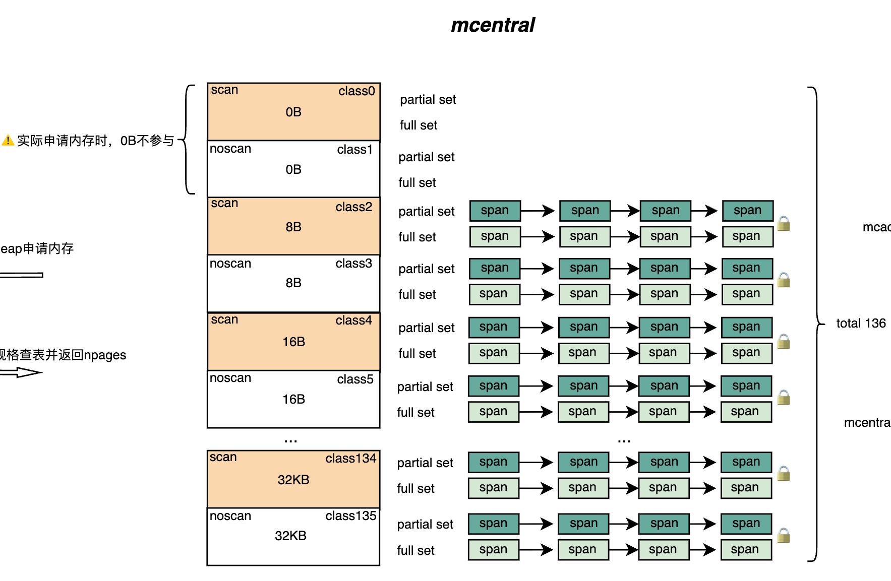

# 05. 内存管理--mcentral
## 1. 核心定位与设计

在 Go 运行时的三层分配架构中，小对象分配通常走这条链路：

**mcache（per-P，本地无锁快路径） → mcentral（按 size class/scan 属性分组的共享中枢） → mheap（全局页级分配与 span 创建）**

`mcentral`的核心价值不在于“分配对象”，而在于**提供可复用的 mspan** 并把全局竞争降到可控范围：

- 如果所有 P 都直接向 `mheap`申请 span，会导致全局锁竞争成为瓶颈。
- 如果把过多 span 长期滞留在 `mcache`，会引入更高的内存占用与碎片风险。

## 2. 数据结构解析

`mcentral` 并非独立存在于堆外，而是直接内嵌在 `mheap` 结构体中。

```go
type mheap struct {
    // ... 其他字段
    // 5. 堆内存的“批发市场”(mcentral 数组)
    central [numSpanClasses]struct {
        mcentral mcentral
        pad      [cpu.CacheLinePadSize - unsafe.Sizeof(mcentral{})%cpu.CacheLinePadSize]byte
    }
}
```

- **数组结构**：`central` 是一个长度为 `numSpanClasses`（通常为 136， `68 * 2` 包含 scan 和 noscan）的数组 。这意味着每一种规格（如 8B, 16B...）都有一个独立的 `mcentral` 实例负责管理。
- **Padding 填充**：代码中的 `pad` 字段至关重要。不同 P 的 refill 会命中不同 class 的 `mcentral`，让每个 `mcentral`尽量独占 cache line 能显著降低跨核 cache 抖动。

### 2.1 mcentral 内部结构

```go
type mcentral struct {
    // 1. 占位符：防止结构体被分配在堆上（必须嵌入在 mheap 中）
    _ sys.NotInHeap

    // 2. 规格 ID：当前 mcentral 管理的 span 规格（如 8B, 16B...）
    spanclass spanClass

    // 3. 有空位的 Span 集合（双缓冲）
    partial [2]spanSet

    // 4. 无空位的 Span 集合（双缓冲）
    full    [2]spanSet
}
```

`mcentral` 的核心职责是管理两类 Span 链表：

1. **spanclass**：当前 mcentral 管理的 span 规格，mcentral是按class进行加锁申请和分配内存的。
2. **partial (有空位)**：包含“至少有一个空闲对象”的 span 集合。这是 `mcache` 进货时的首选目标。
3. **full (已满/被占用)**：包含“没有空闲对象”的 span 集合。
`mcentral`的结构如图1所示：


*图1: mcentral示意图*

结合图1和源码的逻辑，`mcentral`针对`scan`和`noscan`的对象类型进行了分类，

- **scan（contains pointers）**：该 class 的对象可能包含指针，GC 标记时需要扫描对象内容以发现引用。

- **noscan（no pointers）**：该 class 的对象不包含指针，GC 标记时无需扫描对象内容，从而降低标记成本。

这种设计可以提升垃圾回收的效率，减少垃圾回收的成本。无论何种类型的内存区域，都是通过partial和full列表进行管理，这种设计也可以提升垃圾回收的效率，当mcache进行内存申请时，优先从partial列表获取，然后才回去获取full列表中的span。` partial/full [2]spanSet`是一个大小为2的数组，并不是1，在源码中，有这么一段逻辑：
```go

// partialUnswept returns the spanSet which holds partially-filled// unswept spans for this sweepgen.  
func (c *mcentral) partialUnswept(sweepgen uint32) *spanSet {  
    return &c.partial[1-sweepgen/2%2]  
}  
  
// partialSwept returns the spanSet which holds partially-filled// swept spans for this sweepgen.  
func (c *mcentral) partialSwept(sweepgen uint32) *spanSet {  
    return &c.partial[sweepgen/2%2]  
}

// fullUnswept returns the spanSet which holds unswept spans without any// free slots for this sweepgen.  
func (c *mcentral) fullUnswept(sweepgen uint32) *spanSet {  
    return &c.full[1-sweepgen/2%2]  
}  
  
// fullSwept returns the spanSet which holds swept spans without any// free slots for this sweepgen.  
func (c *mcentral) fullSwept(sweepgen uint32) *spanSet {  
    return &c.full[sweepgen/2%2]  
}
```

`sweepgen` 用于标识运行时当前的 **sweep generation（清扫代际）**。`mcentral` 将 `partial/full` 维护为两个集合（`[2]spanSet`），并通过 `sweepgen` 推导出“当前视角下的 swept/unswept 索引”（如 `sweepgen/2%2` 与 `1-sweepgen/2%2`）。这样在 GC 代际切换时，无需遍历所有 span 重分类，只需 **O(1) 地切换索引视图**，即可把“已清扫/未清扫”的逻辑分区完成翻转。

---

## 3. 核心机制：Full 与 Partial 的流转

`mcentral` 的高效运作依赖于 span 在 `partial` 和 `full` 两个集合间的精准流转。这是一个动态平衡的过程。

### 3.1 进货逻辑

当某个 P 的 `mcache` 在某个 `spanClass` 上耗尽时，会触发 refill。`mcentral.cacheSpan` 的目标是返回一个“可分配对象的 span”，流程可概括为：

1. **查找 Partial (Swept)**：优先查找 `partial` 列表中那些**已经完成 GC 清扫**且有空位的 span。这是最快路径，拿到即用。

2. **查找 Partial (Unswept)**：如果没找到，尝试查找 `partial` 列表中**尚未清扫**的 span。找到后，原地触发清扫，如果清扫后有空位，则返回，否则归入适当集合。

3. **查找 Full (Unswept)**：如果 `partial` 空了，去 `full` 列表中找那些“逻辑上满但包含死对象”的 span。对其进行清扫，如果回收了空间，将其移入 `partial` 并返回。

4. **兜底 (Grow)**：如果同规格确实缺 span，则向 `mheap`申请页并创建新 span。
### 3.2 归还逻辑

当 span 在 `mcache` 中被再次填满，或者因为 GC 导致 span 归还时：

- span 会被移回 `mcentral`。

- 如果 span 还有空位，放入 `partial` 集合。

- 如果 span 满了，放入 `full` 集合。

### 3.3 refill流程图


 *图2: refill 流程示意*
 
---

## 4. 关键交互：mcentral 与 mheap 的扩容协议

`mcentral` 自身不持有物理内存的所有权，它只是管理者。真正的内存分配发生在 `mheap`。

### 交互流程

1. **计算需求**：当 `mcentral` 决定扩容时，它根据自身管理的 Size Class，查表得知需要的页数 `npages`*（例如：Class 10 需要 2 页，即 16KB）*。
2. **向 mheap 申请页**：进入 `mheap` 的页级分配（内部可能涉及全局锁或更细粒度同步），在 page allocator 中找到连续空闲页并标记占用。
3. **初始化 mspan**：设置 span 的边界、对象布局相关元数据，并初始化分配位图（allocBits）与 GC 标记位图等。
4. **返回给 cacheSpan**：作为“进货结果”交给触发 refill 的 `mcache`，从而恢复小对象分配快路径。

## 5. 总结

`mcentral` 是 Go 内存分配器中“化整为零”的关键环节。

- 它通过 **Span Class** 将内存管理标准化。
- 它通过 **Partial/Full 双集合** 机制，实现了内存的惰性清理与高效复用。
- 它通过 **Per-Class 的细粒度锁**，在避免全局锁竞争的同时，保证了多线程分配的安全性 。