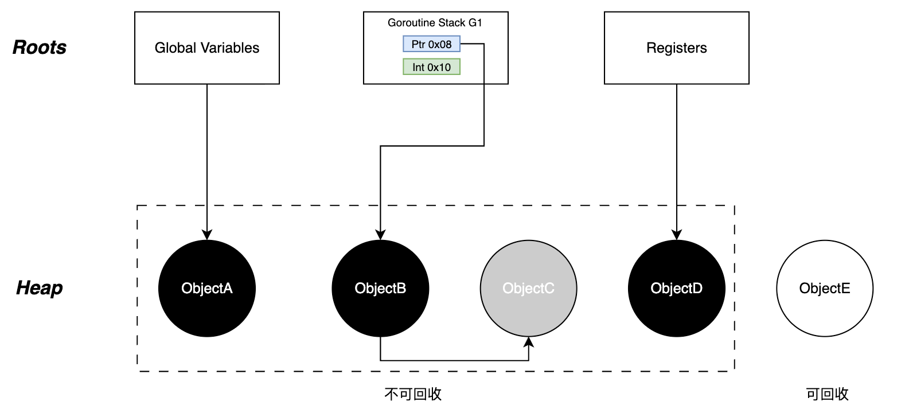
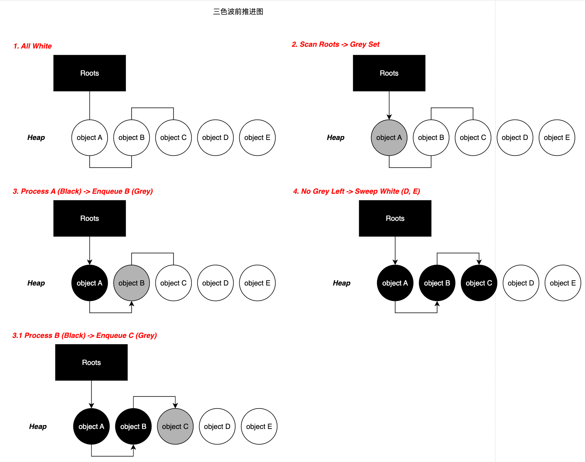
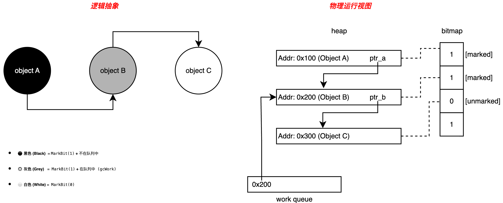

# 07. GC--三色标记法

## 1. 概述

Go runtime 的 GC 设计目标偏向低延迟与可预测停顿。整体采用**非分代、并发的标记-清扫**框架，以**三色标记法**作为可达性分析核心，并通过**写屏障**与 **mutator assists** 在并发修改对象图的情况下维持标记正确性。根对象（栈、全局变量与运行时根等）定义了标记起点，三色推进过程完成从根到堆的可达性闭包，最终清理不可达对象。

---

## 2. 根集合

GC 的本质是可达性分析。算法必须从一组被视为"绝对活跃"的对象出发，递归扫描整个对象图：所有可达对象判定为存活，不可达对象在清扫阶段回收。这组起始对象即**根集合（Root Set）**。内存拓扑示意如图 1 所示。

*图 1：内存拓扑示意*

该图展示了 GC 视角的内存分层结构：

- **Roots 层（上层）**：包含全局变量、goroutine 栈（G1）、寄存器。
- **Heap 层（下层）**：包含动态分配的对象 A、B、C、D、E。

**引用关系**：

- Roots 直接指向 ObjectA、ObjectB、ObjectD。根扫描将根直接可达对象标记并加入工作队列，它们在逻辑上进入灰色集合，待 worker 取出并扫描完其字段后转为黑色。
- ObjectB 引用了 ObjectC，通过传递引用维持了 C 的存活。
- ObjectE 无任何引用指向它（不可达），属于可回收区域。

Roots 层各元素说明如下：

- **全局变量（Global Variables）**
  - **物理位置**：编译期确定的数据段（`.data`）和未初始化数据段（`.bss`）。
  - **生命周期**：与 Go 进程生命周期一致，常驻内存。其指向的堆对象（如图中 ObjectA）属于静态根可达，绝不会被回收。

- **栈帧（Goroutine Stack）**
  - **动态性**：每个 goroutine 都有独立的栈。所有处于 `_Grunning`、`_Grunnable` 等活跃状态的 G，其栈上的指针变量均为根。
  - **精确式扫描**：Go 编译器会在函数调用处插入 stackmap，GC 借此准确区分栈上的数据是指针还是标量（图1中，能够区分 `0x08` 处的指针与 `0x10` 处的整数），从而避免将整数误判为指针导致内存泄漏。

- **寄存器（Registers）**
  - **现场保护**：寄存器代表硬件执行的现场。为追求极致性能，编译器会将高频使用的指针暂存于寄存器而非写回内存，因此 GC 必须扫描当前 P 绑定的 M（系统线程）中的寄存器，否则会导致活跃对象丢失。

---

## 3. 三色标记抽象

三色标记法是 Dijkstra 提出的并发图遍历算法，通过三种颜色状态描述对象在**波前**中的位置。标记与推进过程如图 2 所示。

*图 2：三色标记与推进*

### 3.1 状态定义

1. **白色——潜在垃圾**
   - **定义**：尚未被 GC 扫描到的对象，或扫描结束后确认不可达的对象。
   - **流转**：GC 开始时全白；GC 结束时，剩余白色对象即为垃圾。

2. **灰色——扫描波前**
   - **定义**：自身已被标记为活跃，但其引用的子对象尚未全部扫描。
   - **作用**：灰色集合构成推进的波前，将黑色（已知存活）与白色（未知区域）分隔开。

3. **黑色——安全存活**
   - **定义**：自身已被标记，且所有子对象均已扫描（或已加入灰色队列）。
   - **特性**：GC 认为黑色对象绝对安全，不会再回头扫描。

### 3.2 标记流转过程（BFS）

整个标记过程是标准的广度优先搜索：

1. **Init（全白）**：初始状态，所有堆对象（A–E）均为白色。

2. **Scan Roots（根扫描 -> 灰）**：
   - GC 遍历 Root Set（栈、全局变量等），找到根直接指向对象 `A`。
   - 将 `A` 的 `gcmarkBits` 置为 1，并将 `A` 的指针加入 `gcWork` 队列，此时 `A` 逻辑上转为灰色。
   
3. **Process Grey（波前推进 -> 黑）**：
   - **出队（变黑）**：Worker 从 `gcWork` 队列中取出对象 `A`。此时 `A` 仍被标记（Bit=1）但已离队，逻辑上转为**黑色**。
   - **扫描子对象（变灰）**：扫描 `A` 的内存块，找到其引用的子对象 `Child`。  
   - 若 `Child` 为白色（`gcmarkBits=0`），则将其置为 1 并加入队列（`Child` 变灰）。
   
4. **Finish**：重复步骤 3，直至灰色队列清空。

---

## 4. 位图与工作队列

在 Runtime 的物理实现中，并没有在对象头中存储"颜色"字段，而是采用**位图**与**队列**相结合的方式来表达三色状态。为了更深入地了解运行时如何对黑、白、灰进行扫描和标记，下面结合图 3 进行说明。

*图 3：三色状态的物理定义*

该图通过进一步的揭示了 Go Runtime 的底层实现，结合3.2的标记流转的内容：

- **位图（Bitmap）**：右侧展示了 `gcmarkBits`，ObjectA 和 ObjectB 的对应位均为 `1`（marked），ObjectC 为 `0`。
- **工作队列（Work Queue）**：底部队列中存储了指向 ObjectB 的指针 `ptr_b`。

**状态公式**：

| 逻辑颜色 | 条件 |
|----------|------|
| 黑色（Black） | MarkBit = 1，且**不在**队列中 |
| 灰色（Grey）  | MarkBit = 1，且**在**队列中   |
| 白色（White） | MarkBit = 0                   |

### 4.1 标记位图

Go 未在对象头中存储所谓的"颜色"字段，以避免破坏内存对齐并降低开销。

- **物理存储**：利用 `mheap.arenas` 中每个 `heapArena` 的 `gcmarkBits` 位图。
- **状态映射**：
  - **黑色**：`gcmarkBits` 对应位为 1。
  - **白色**：`gcmarkBits` 对应位为 0。
  - **灰色**：无显式位标记。灰色是复合逻辑状态，即`gcmarkBits` 为 1 **且** 该对象指针存在于 `gcWork` 队列中。

### 4.2 工作队列与负载均衡

这是 GC 与 **GMP 调度模型**的结合点。

- **本地化**：为减少全局锁竞争，Go 采用去中心化设计。每个 P 拥有由两个本地缓冲区（`wbuf1`、`wbuf2`）构成的 `gcWork`，写屏障和根扫描产生的灰色对象优先存入本地。
- **工作窃取**：当某个 P 闲置（本地无灰色对象）时，它会从其他 P 的 `gcWork` 或全局队列中窃取标记任务，从而最大化并发标记阶段的 CPU 利用率并减少长尾效应。

---

## 5. 并发下的漏标问题

在并发标记阶段，用户代码（Mutator）可能在 GC 扫描的同时修改引用关系，导致**漏标**：活跃对象被错误地遗漏标记，最终被错误回收。

**典型漏标场景**：

1. GC 扫描了对象 `A`，将其涂黑（认为 `A` 已处理完毕）。
2. Mutator 执行 `A.ptr = C`：令黑色的 `A` 指向白色的 `C`。
3. Mutator 执行 `B.ptr = nil`：切断了灰色 `B` 到 `C` 的原有引用。
4. **结果**：`C` 实际被 `A` 引用、应当存活，但由于 `A` 已黑（GC 不会再扫描），且`B` 不再指向 `C`，`C` 将永远保持白色，最终被**错误回收**。

这就是并发 GC 的核心矛盾：**黑色对象引用白色对象**，即三色不变式遭到破坏。为解决此问题，Go 引入了混合写屏障机制，将在下一篇文档中详细阐述。

---

## 6. 总结

- **根集合**定义了标记的起点：全局变量、各 goroutine 栈以及safepoint 下的寄存器现场共同构成 Root Set。
- **三色标记**以白/灰/黑表达并发遍历的"波前推进"：根可达对象先入灰，扫描完成后转黑，剩余白色对象在清扫阶段回收。
- **物理实现**中，"是否标记"由位图承载，"灰/黑"是逻辑状态，由工作队列与扫描进度共同体现。