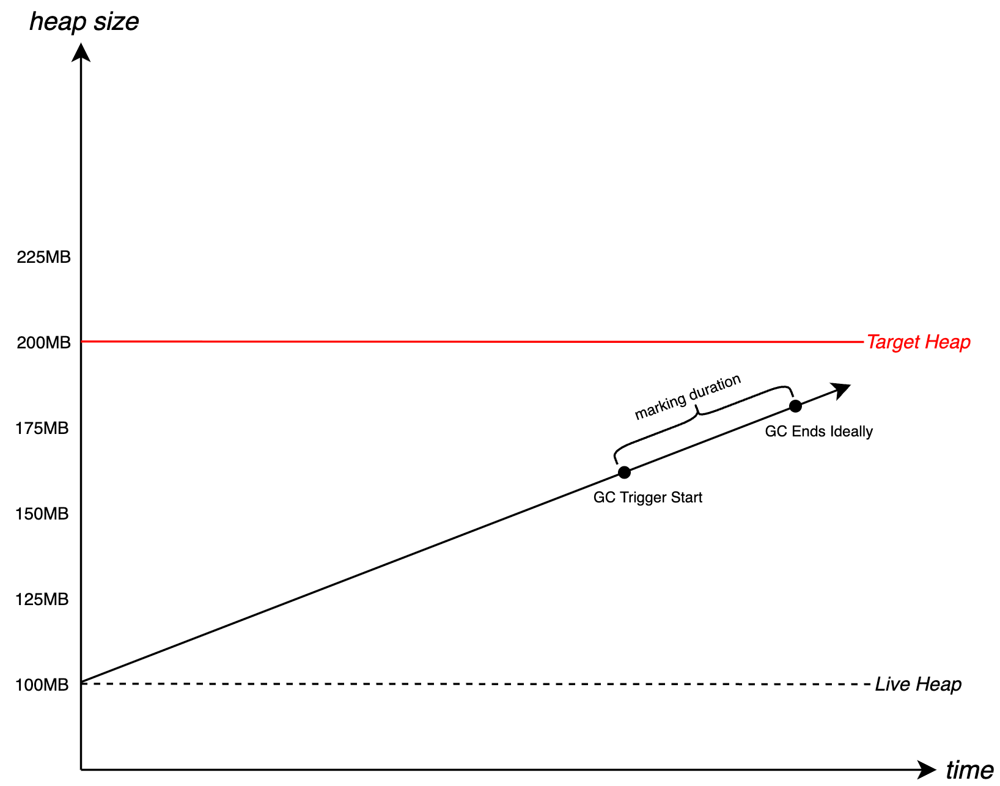
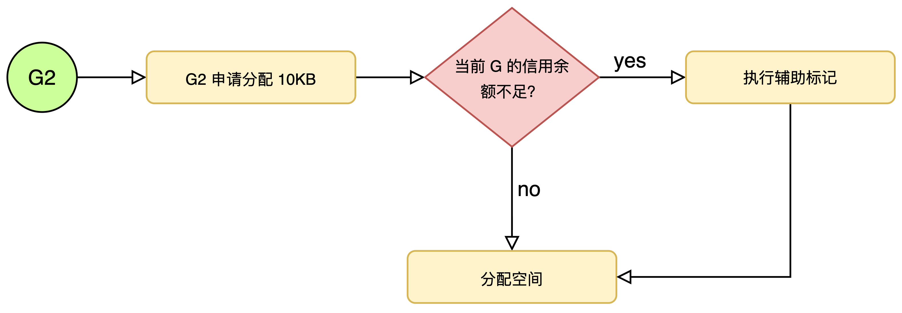

# 09. GC--调度与目标控制机制

## 1. 引言

在通过 **三色标记法** 解决了“怎么回收”，并通过**混合写屏障**解决了“并发安全”之后，go runtime面临着一个更棘手的工程问题：**如何在不同负载下稳定地控制 GC 的节奏**。如果 GC 启动得太频繁，会把 CPU 时间过多消耗在扫描与标记上，应用吞吐下降；如果启动得太晚，堆增长可能在标记完成前就接近极限，最终触发内存压力甚至 OOM。
Go 为此引入调步器（Pacer）：它根据“存活堆大小、分配速率、标记（扫描）速率、内存上限”等信号，计算：

- 本轮 GC 的 **堆目标（heap goal / target）**
- 本轮 GC 的 **触发点（trigger）**：什么时候必须启动并发标记
- 在紧急情况下的 **辅助标记（mark assist）力度**：用负反馈压制过快分配

---

## 2. 核心公式：GOGC 与 堆目标

Go GC 的一切控制逻辑都始于一个最基础的参数：`GOGC`（默认 100）。它描述了“允许堆在两次 GC 之间增长的比例”，从而定义下一轮 GC 的**目标堆大小**（更准确地说是 heap goal）。
公式定义：

$$TargetHeap = LiveHeap + LiveHeap \times \frac{GOGC}{100}$$

其中：

- **LiveHeap**: 上一次 GC 结束时，存活下来的对象总大小。
- **GOGC = 100**: 意味着允许堆内存增长 **100%**（即翻倍）。（例如 live=10MB，则heap goal≈20MB）

*图1: go gc增长模型*

>**注意：** `Target Heap (20MB)` 是 GC 的**目标终点**，但并不是 GC 的**触发点**。 为了保证在到达 20MB 之前完成标记，GC 实际上会在比如 15MB 或 18MB 的时候就**提前触发**。我们在调步器中详细阐述该原理。

---

## 3. 调步器原理：触发时机

GC 不能等到内存真的到了 `Target Heap` 才开始跑，因为标记过程需要时间。如果在 20MB 时才开始标记，等标记完，用户可能已经分配到 30MB 了（超标）。因此，Pacer 必须根据**当前的分配速度**和**扫描速度**，计算出一个提前量，这就是**Trigger**。

- **Trigger**: GC 实际开始的堆大小（介于 Live 和 Target 之间）。
- **Heap Goal**: Pacer 期望 GC 结束时，刚好不要超过 Target。

图2通过live heap和target heap之间的增长关系及触发时机进一步说明了GC触发的时机，其会在服务到达target这条线之前介入，保证程序不会陷入OOM的状态（除非物理内存耗尽的情况下，一般情况不会出现OOM的情况。）

*图2: gc触发时机*

---

## 4. 兜底机制：辅助标记

### 4.1 mark assist机制

Pacer 的 Trigger 计算基于“分配速率 vs 扫描速率”的预测，但预测并非总是准确：如果 mutator 突发分配，出现 **分配速率 > 后台标记速率**，堆可能在标记完成前快速逼近 HeapGoal。这时，Go 会启动 辅助标记 (Mark Assist) 机制。
**原则：“谁污染，谁治理”。**
如果某个goroutine分配内存太快，runtime就会向你征收其进行协助标记操作，例如你想分配 1MB 内存，请先帮忙扫描 2MB 的对象，才能给分配。这种**负反馈机制**能有效压制过快的分配速率，防止 OOM。其根据一个比例来决定goroutine参与GC的频率和每次需要协助标记的空间大小。

$$assistRatio = \frac{\text{剩余的待扫描工作量 (Scan Work Remaining)}}{\text{剩余的可用堆空间 (Heap Space Remaining)}}$$

- **分子（工作量）**：系统估计还需要扫描多少内存（灰色对象 + 潜在的灰色对象）才能完成标记。
- **分母（空间）**：距离 `Heap Goal`（硬性目标）还剩多少字节可以分配。

 **如果空间还很多，但活很少**：Ratio 很低（< 1），几乎不需要辅助，后台 GC 慢慢扫就行。**如果空间快没了，活还堆积如山**：Ratio 爆炸（> 100），分配 1KB 内存可能要扫描 100KB 对象。这时分配内存的goroutine 几乎就是被“卡死”在辅助标记里。大体流程如图3所示。
 

*图3: mark assist流程示意*

通过mark assist的机制保证即使当前申请的速度大于甚至远大于GC的速度时，也可以让go程序不那么快的陷入OOM的情况。图4描述了mark assist机制参与后，内存申请的速度明显变的更平缓了，这表明了goroutine已经参与到了额垃圾回收的部分工作中，只有完成对应的“负债”归还才可以继续进行内存申请。

*图4: mark assist触发后的内存使用情况示意*

### 4.2 CPU 利用率控制

go 试图将后台标记的 CPU 使用控制在一个目标比例附近（例如 25%），以避免 GC 持续抢占应用吞吐；而当风险升高时，Mark Assist 可以临时借用mutator CPU 来兜底。

- 如果是 4 核 CPU，GC 默认启动 1 个后台 Worker。
- 如果是 8 核 CPU，启动 2 个。
- **Mark Assist** 实际上利用了用户线程的 CPU 时间，突破了这 25% 的限制，属于“借用”算力来救火。

---

## 5. k8s与GOMEMLIMIT

随着云原生架构的普及，Go 程序被广泛部署于 Kubernetes 等容器编排平台中。在这些受限的资源环境（Cgroups）下，传统的基于 `GOGC` 的调步机制暴露出了“容器限额盲区”的问题。为了解决这一工程挑战，Go 1.19 引入了 `GOMEMLIMIT` 机制，实现了对内存总量的硬性约束。
### 5.1 容器限额盲区与OOM Kill

在 Go 1.19 之前，Go 运行时的 Pacer 仅感知堆内存的相对增长（通过 `GOGC` 比率），而无法直接感知操作系统或容器施加的物理内存限制（Memory Limit）。在前文中我们提到过关于`GOGC` 定义的是“下一次 GC 的目标堆大小”，其计算公式为

$$TargetHeap = LiveHeap + LiveHeap \times \frac{GOGC}{100}$$

该公式并未考虑容器的 `limits.memory` 上限。考虑这么一个场景，假设一个 Go 服务部署在 `limits.memory=4GB` 的容器中，`GOGC=100`（默认值）：

1. 服务在某次 GC 后，存活对象（Live Heap）达到了 **2.5GB**。
2. Pacer 按照公式计算下一次触发 GC 的目标阈值：$2.5GB \times (1 + 100\%) = 5GB$。
3. 结果：Pacer 预期在堆增长到 5GB 时才完成下一轮 GC。然而，当内存增长到 **4GB** 时，容器触发了 Linux内核的 OOM Killer，导致服务被强制终止。

这种现象被称为“过激的调步目标”：Pacer 设定的Target Heap超出了物理环境的硬性限制Physical Limit。
### 5.2 使用GOMEMLIMIT的硬性约束

`GOMEMLIMIT`（Go Memory Limit）为 Go 运行时引入了一个明确的内存总量上限。它从根本上改变了 Pacer 的决策逻辑，使其从单一的“比例控制”转变为“比例控制 + 阈值截断”的双重策略。Pacer 在计算 GC 触发时机时，会同时参考 `GOGC` 计算出的目标值和 `GOMEMLIMIT` 设定的限制值，并取两者的 **较小值** 作为最终的 Target Heap。

$$FinalTarget = \min(Target_{GOGC}, GOMEMLIMIT - \text{Overhead})$$

当内存使用量逼近 `GOMEMLIMIT` 时，Pacer 会采取激进措施：

1. **忽略 GOGC**：即使尚未达到 `GOGC` 设定的增长比例，只要触及 `GOMEMLIMIT` 警戒线，也会强制触发 GC。
2. **牺牲 CPU 换空间**：为了避免 OOM，运行时会高频启动 GC 并增加辅助标记（Mark Assist）的力度。这会导致 CPU 使用率瞬间飙升，但能保证服务存活。

当然，不仅仅是k8s的容器环境中存在上述问题，在普通服务器运行环境中同样存在上述问题，不过由于k8s的容器环境对内存限制比较苛刻（例如2GB、4GB这样内存），所以更容器触发该问题。最佳的实践是，无论是在什么运行环境都应该对`GOMEMLIMIT`进行配置，避免出现服务被kill的情况。

## 6. 总结

Go 运行时通过引入**调步器 (Pacer)** 构建了一个基于反馈回路的动态控制系统，旨在高并发环境下实现吞吐量与内存开销的处于最佳的平衡点。该系统通过以下三个核心维度的精密计算与调度来实现：

- **GOGC** 决定了内存扩张的幅度（空间换时间）。
- **Trigger** 决定了 GC 开始的**时机**（防止过晚）。
- **Mark Assist** 是防止内存溢出的**最后一道防线**（通过压制用户分配速度来换取安全）。