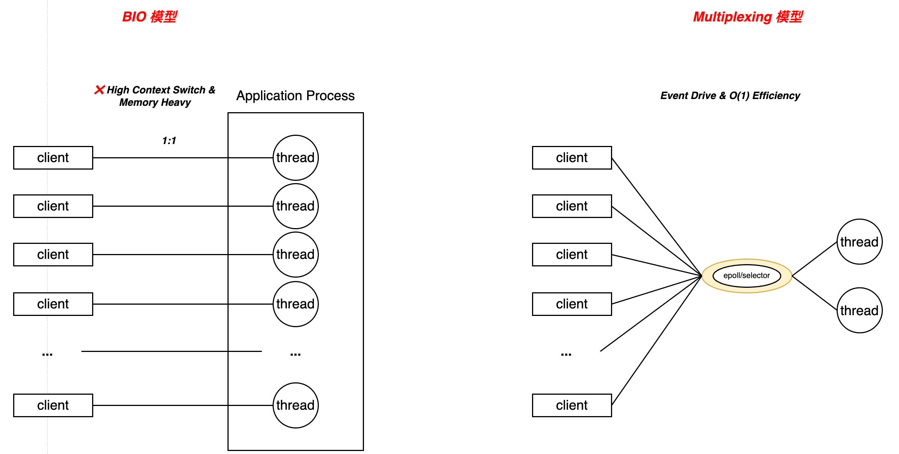

# 10. 网络模型--IO多路复用

## 1. 前言

### 1.1 从一段代码开始

当我们使用go进行网络编程时，如果直接引用`net/http`的包，那么代码大致如下：

```go
func handler(w http.ResponseWriter, r *http.Request) {
    // 1. 读取网络请求 Body
    body, _ := io.ReadAll(r.Body) 
    
    // 2. 业务处理...
    
    // 3. 写入网络响应
    w.Write([]byte("Hello, World!"))
}

func main() {
    http.HandleFunc("/", handler)
    http.ListenAndServe(":8080", nil)
}
```

在这段代码中：

- `r.Body.Read` 并没有立即返回 `EAGAIN` 错误让我们重试，而是直到数据读完。
- `w.Write` 也没有要求我们注册可写事件的回调。

我们沿着上述代码深挖，从`w.Write`方法着手，在`net/http/server.go`中可以看到如下逻辑：

```go
// ResponseWriter 的底层实现
type response struct {
    conn *conn       // 引用了底层的 HTTP 连接对象
    // ...
}

func (w *response) Write(data []byte) (n int, err error) {
    // ... 经过一系列缓冲区处理 ...
    return w.conn.bufw.Write(data) // 最终调用 bufio 写入
}
```

`w.conn` 结构体中持有一个核心成员 `rwc` (ReadWriteCloser)，它实际上就是 `net.Conn` 接口的实现，也就是`net/http`只是对TCP连接的一层协议包装，核心功能还是在`net`库中实现。

### 1.2 异步非阻塞

当我们调用 `net.Conn.Read` 时，调用链会经过 `TCPConn` -> `netFD` -> `poll.FD`。在`internal/poll/fd_unix.go`中，可以发现为什么在应用层调用的类似于阻塞，但实际逻辑却是非阻塞的原因。我截取了一部分代码片段如下：

```go
func (fd *FD) Read(p []byte) (int, error) {
    // ... 锁处理 ...
    for {
        // 1. 尝试直接进行系统调用 (syscall.Read)
        n, err := startRead(fd) 
        
        // 2. 如果系统调用成功，或者发生了非 I/O 错误，直接返回
        if err == nil {
            return n, nil
        }
        
        // 3. 如果系统调用返回 syscall.EAGAIN.
        // 说明内核缓冲区空了，没有数据可读
        if err == syscall.EAGAIN {
            // 4. 调用 waitRead，挂起当前 goroutine
            if err = fd.pd.waitRead(fd.isFile); err == nil {
                continue 
            }
        }
        
        return n, err
    }
}
```

go针对以往需要（例如cpp编程中）用户手动去处理的内容进行了封装，所以直接调用http包的方法就和阻塞调用一样，其底层实现是非阻塞的，而这种非阻塞逻辑的实现则是依赖操作系统的**I/O 多路复用技术**。

---

## 2. BIO vs Multiplexing

要理解 Netpoller 的设计必要性，首先简单回顾下高性能网络编程的演进史。
### 2.1 传统阻塞 I/O (BIO)

在 BIO 模型中，采用 **Thread-per-Connection** 模式。

- **机制**：每一个 Client 连接必须独占一个操作系统线程。
- **痛点**：线程栈与内核调度开销随连接数线性增长（默认栈常见 MB 级），连接数上万时内存与上下文切换成本都会迅速压垮吞吐。

### 2.2 I/O 多路复用

多路复用引入了一个代理机制（`select/poll/epoll`）。

- **机制**：业务线程不再对某个socket做阻塞式等待，而是把一组 fd 注册到同一个事件监听集合，随后阻塞在一次系统调用（如 `epoll_wait`）上，等待内核返回就绪事件列表；线程拿到就绪 fd 后再执行对应的非阻塞读写与业务处理。

- **收益**：
    - **等待与处理解耦**，用少量线程即可完成海量连接的 I/O 就绪等待与分发（典型是 1~N 个 I/O 轮询线程服务大量连接，业务逻辑可由线程池/协程调度执行）。
    - **事件就绪驱动**，内核只返回已就绪的 fd（成本主要与就绪事件数相关），避免对大量空闲连接进行轮询扫描。

上述描述了bio和i/o多路复用的区别，通过图1进一步了解当处理网络连接时，两种模型区别。

*图 1：bio vs multiplexing*


- **BIO**：1:1的模式，高上下文切换与高内存占用是其核心问题。
- **Multiplexing**：通过 `epoll` 收敛连接，即使监控百万连接，若仅少量连接活跃，用户态主要处理的是这少量就绪事件（近似 O(k)）。

---

## 3.  Epoll 简析

在 Linux 平台上，Go Netpoller 的核心基于 `epoll`模型实现。`epoll`模型的核心功能和主要结构如图2所示。

*图2: epoll模型*

从上图可以清晰地了解到，`epoll` 模型通过 `epoll_ctl` 进行文件描述符的注册（*存入红黑树*）。一旦有数据准备好，内核会通过回调机制将对应的就绪事件（fd）加入到`rdllist`中，用户进程（netpoller）随后通过`epoll_wait` 直接获取这些处于就绪状态的文件描述符。
### 3.1 核心组件

不同于 `select/poll` 在每次调用时都需要把待监控的 fd 列表传入内核并逐个扫描（时间开销与监控 fd 数 N 相关），`epoll` 在内核侧将注册集合与就绪队列分离维护，从而避免对大量空闲连接做重复遍历：

1. **注册集合（图2-红黑树）**：存储所有通过 `epoll_ctl(ADD/MOD/DEL)` 注册的文件描述符（fd）及其关注的事件类型（如可读/可写/错误/挂起等）。`epoll_ctl` 的职责是对该集合进行增删改，建立或更新“fd → 事件关注”的映射关系。
2. **就绪队列（图2-rdllist）**：当某个 fd 的状态变化并满足关注条件时，内核会将其标记为就绪并加入（或更新）就绪队列，用于汇总当前需要处理的事件。`epoll_wait` 阻塞等待就绪事件：无事件时睡眠直至超时或被唤醒；有事件时将一批就绪事件批量拷贝到用户态并返回。因此用户态的处理成本主要与本次返回的就绪事件数 k相关，而不是与被监控 fd 的总数线性相关。

### 3.2 工作流程

- **创建 epoll 实例**
    
    - 用户态调用 `epoll_create1()` 。内核创建`eventepoll`对象，并初始化并维护对应的数据结构（例如：红黑树/双向链表）。
    
- **注册/更新监控对象**
    
    - 用户态调用 `epoll_ctl`。内核在红黑树中查找或插入节点，同时在对应的 Socket 等待队列中**注册回调函数**。
    
- **事件就绪与入队**
    
    - 当网络包到达，硬件中断触发协议栈处理，最终触发 socket 状态变化。**之前注册的回调函数被执行**，自动将该 socket 的引用节点添加到 epoll 实例的**就绪队列(rdllist)** 中。
    
- **等待与批量返回（epoll_wait）**
    
    - 用户态调用 `epoll_wait(epfd, events, maxevents, timeout)` 进入等待：
        
        - 若就绪队列为空，则线程(在go中通过将goroutine挂起)睡眠，直到有事件到来或超时；
        - 若就绪队列非空，则内核将就绪事件批量拷贝到用户态提供的 `events[]` 数组并返回。
        
    - 用户态对返回的每个就绪 fd 执行非阻塞读写与业务处理；处理完成后再次调用 `epoll_wait` 进入下一轮事件循环。

### 3.3 边缘触发（ET） vs 水平触发（LT）

#### 3.3.1 水平触发（Level-Triggered, LT）

水平触发的语义是“**只要条件仍然满足，就会持续通知**”。以可读事件为例：只要 socket 的接收缓冲区里还有数据没被读完，`epoll_wait` 每次都会持续返回该 fd 的可读事件。对可写事件同理，只要发送缓冲区仍然有空间，`epoll_wait` 会反复返回可写事件。  
这种模式的优点是实现简单、容错更强：即使用户态这次没把数据读干净、或者业务处理被打断，下一轮 `epoll_wait` 仍然能再次拿到事件，不容易“漏事件”。代价是：如果用户态处理得慢，可能会出现同一个活跃 fd 被频繁返回，带来一定的重复唤醒与调度开销。

#### 3.3.2 边缘触发（Edge-Triggered, ET）

边缘触发的语义是“**只在状态发生变化的瞬间通知一次**”。以可读事件为例：只有当接收缓冲区从 **“无数据 → 有数据”** 发生跃迁时才触发通知；如果用户态没有把数据读到 `EAGAIN`，后续即使缓冲区里仍然有剩余数据，epoll 也**可能不会再次通知**（除非又有新的数据到达引发新的跃迁）。因此 ET 的正确使用方式为：**fd 必须是 non-blocking，并且读/写需要循环进行，直到返回 `EAGAIN`（或读到 0 表示对端关闭）**。
ET 的优势在于：在高活跃连接场景下，它可以减少重复事件回传与无效唤醒，更“事件驱动”。但也存在实现上更容易踩坑 *（go的net库已经帮我们进行了封装，在应用层开发完全不用担心😁）*，常见问题是“没有读到 `EAGAIN` 导致后续不再收到通知”，表现为连接假死或吞吐下降。

#### 3.3.3 go采用的et模式

在 linux上，Go runtime 的 netpoller 使用 epoll，并以 **边缘触发（EPOLLET）** 方式注册事件：在 `runtime/netpoll_epoll.go` 中可以看到注册掩码包含 `EPOLLET`。

```go
func netpollopen(fd uintptr, pd *pollDesc) int32 {
    var ev epollevent
    // EPOLLET = Edge Triggered
    ev.events = _EPOLLIN | _EPOLLOUT | _EPOLLRDHUP | _EPOLLET 
    *(**pollDesc)(unsafe.Pointer(&ev.data)) = pd
    return epollctl(epfd, _EPOLL_CTL_ADD, int32(fd), &ev)
}
```

在搞清楚lt和et的主要区别后，我们可以结合go本身的gmp模型采用et模式的主要原因：

1. **减少上下文切换**： Go 程序通常伴随着成千上万个 Goroutine。如果使用 LT 模式，当一个 socket 有数据且 Goroutine 处理稍慢时，`epoll_wait` 所在的线程（M）可能会被反复唤醒，告知同一个 fd 就绪,这对于调度器来说是巨大的干扰。
2. **与 GMP 模型的完美配合**： Go 的 Runtime 设计了一种机制，让同步的写法享受异步的性能。 当 Goroutine 发起 `Read()` 调用时，底层其实是在进行非阻塞 I/O。

---

## 4. Netpoller

Go runtime 为了在不同操作系统上统一网络 I/O 的等待与唤醒机制，引入了 **netpoller抽象层**：在 Linux 上基于 `epoll`，在 macOS/BSD 上基于 kqueue，在 Windows 上基于 IOCP。应用层仍以同步风格调用 `Read/Write`，但 runtime 会在底层通过“非阻塞 fd + 事件轮询 + goroutine 挂起/唤醒”来实现高并发伸缩。

### 4.1 核心结构体`pollDesc`

`pollDesc` 是 Runtime 层面描述网络文件描述符（FD）的核心结构，它是连接底层系统 FD 与上层 Goroutine 的桥梁。

```go
// runtime/netpoll.go
type pollDesc struct {
   link *pollDesc //链表指针，用于在 runtime 内部管理 pollDesc 对象池 
   fd uintptr //系统底层的文件描述符 
   // rg 和 wg 是原子操作的状态机，可能的值为： 
   // 0: 初始状态 (pdNil) 
   // 1: IO 准备就绪 (pdReady) 
   // 2: 等待中 (pdWait) 
   // <G的地址>: 具体的 Goroutine 阻塞在这里 
   rg uintptr // Read Group:读操作相关的状态或 G 地址 
   wg uintptr // Write Group:写操作相关的状态或 G 地址
}
```

- **状态机机制 (CAS)**：`rg` 和 `wg` 并不总是直接存储 Goroutine 的地址。它们通过原子操作（CAS）在 `pdReady`（就绪）、`pdWait`（等待中）和 `G pointer`（休眠的 G）之间流转。这解决了多线程下 Netpoller 唤醒与 Goroutine 自身状态变更的竞争问题。

### 4.2 核心接口映射

Go 的网络层最终会调用以下三个底层函数，它们与`epoll`模型的底层方法一一对应：

| **Go Runtime 函数**         | **Linux系统调用**   | **作用描述**                                                                                                                                                       |
| ------------------------- | --------------- | -------------------------------------------------------------------------------------------------------------------------------------------------------------- |
| **`netpollinit()`**       | `epoll_create1` | **初始化**：创建一个 epoll 实例（epfd），通常在程序启动或首次使用网络时调用一次。                                                                                                               |
| **`netpollopen(fd, pd)`** | `epoll_ctl`     | **注册**：将新的 fd 添加到 epoll 监听集合中。                                                                                                                                 |
| **`netpoll(delay)`**      | `epoll_wait`    | **轮询**：扫描就绪的网络事件。<br>1. 调用 `epoll_wait` 获取就绪的 fd 列表。<br>2. 根据 fd 找到对应的`pollDesc`。<br>3. 查看 `rg/wg`，取出其中阻塞的 goroutine。<br>4. 返回一个可运行的goroutine链表(`gList`) 给调度器。 |

---
## 5. 总结

至此，我们已经梳理了 Go 网络库的设计原理，理解了 Netpoller 如何利用 `epoll` 模型高效处理海量并发连接。下一篇，我们将从GMP调度的维度出发，通过源码级视角分析 Netpoller 与 Runtime 的联动机制。我们将详细探讨 Goroutine 的生命周期流转，以及调度器如何利用P的本地队列等特性来优化性能。