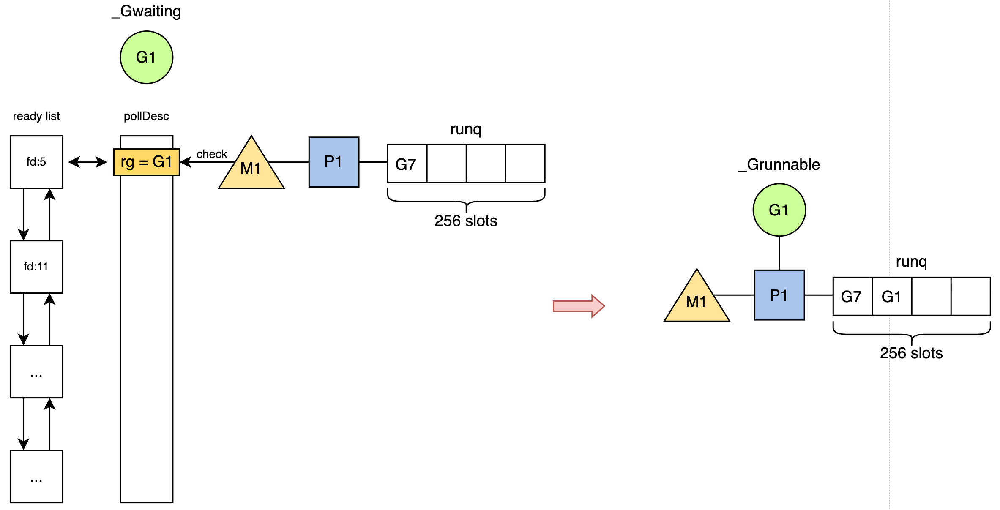

# 11. 网络模型--同GMP模型协作

## 1. 背景

在 Go Runtime 层面，网络 I/O 模型实现了“用户态同步，内核态异步”的抽象。当 Goroutine 执行 `conn.Read()` 阻塞时，该阻塞仅作用于 Goroutine 逻辑层面（逻辑挂起），而非操作系统线程（物理阻塞）。整个 I/O 生命周期由 Runtime 的 **Netpoller** 接管，形成了由 **Park（挂起）** 与 **Ready（唤醒）** 构成的闭环状态流转机制。

---

## 2. 第一阶段：挂起流程

当用户代码发起读操作（如 `conn.Read`）且内核 Socket 接收缓冲区为空时，Runtime 将触发非阻塞 I/O 流程，通过状态流转避免 M（系统线程）陷入阻塞 。图1描述了发生`read`操作时，g和m的状态。

*图1: read操作下的g和m*
### 2.1 非阻塞系统调用与状态检测

Runtime首先尝试直接发起非阻塞系统调用（`syscall.Read`）：

- **数据就绪**：若返回值 $n > 0$，则直接完成内存拷贝并返回，此时无调度开销。
- **数据未就绪**：若内核返回`EAGAIN`，表明缓冲区不可读，进入挂起阶段。

### 2.2 事件订阅

进入挂起流程后，Runtime定位到该文件描述符（FD）关联的 `pollDesc` 结构体。系统将当前 Goroutine 的内存地址（`gp`）原子写入 `pollDesc.rg` 字段。这一步建立了底层 I/O 事件与上层执行体的直接映射关系。

### 2.3 上下文切换与线程复用

随后，Goroutine 调用 `gopark` 函数执行核心挂起操作：

1. **状态流转**：Goroutine 状态由`_Grunning`变更为`_Gwaiting`。
2. **解绑 M**：进入`_Gwaiting`状态后，主动让出执行权，解除与当前M的绑定。
3. **调度复用**：M 线程并不进入休眠状态，而是立即进入调度循环，尝试从当前处理器（P）的本地队列获取下一个可运行的 G；若本地队列为空，则从全局队列获取或从其他 P 执行任务窃取。

此机制保证了OS线程的高饱和度运行，CPU资源保持高利用率，将I/O等待成本转化为 Goroutine 上下文切换成本。

---

## 3. 第二阶段：唤醒流程

当物理网卡接收到数据包并触发硬中断后，内核协议栈处理流程会将对应 Socket 的文件描述符（FD）加入到 `Epoll` 的就绪列表中。Runtime 通过 Netpoller 机制（`epoll_wait`）感知该事件，并执行以下关键步骤将挂起的 Goroutine 恢复至可运行状态。

1. 当 M 线程从 `epoll_wait` 获取就绪事件时，事件数据（`epoll_data`）中已包含注册阶段存入的 `pollDesc` 结构体指针。Runtime 直接通过该指针访问内存中的 `pollDesc` 结构体，完全绕过了基于 FD 的哈希查找，实现了 **O(1)** 的高效访问。
2. M 通过访问 `pollDesc.rg` 字段获取目标 Goroutine (G1)，并执行严格的原子操作以确保并发安全。原子操作将 `pollDesc.rg` 置空，防止多线程重复唤醒，标记该事件已被处理。通过 CAS (Compare-And-Swap) 操作将 G1 的状态从 `_Gwaiting` 变更为 `_Grunnable`，完成逻辑唤醒。
3. G1 被唤醒后，优先尝试将 G1 放入当前 P 的**本地队列**，减少全局锁竞争并复用热缓存。仅在本地队列满载时，才将 G1 注入**全局队列**等待调度，这也是利用CPU亲缘性策略的体现。

具体唤醒流程如图2所示。

*图2: 网络数据就绪g的唤醒示意*

## 4. 超时控制与 Deadline 机制

Go 的网络 I/O 除了依赖 netpoller 等待 fd 就绪外，还必须解决一个工程问题：**等待不能无限期阻塞**。因此 `net.Conn` 提供了 Deadline 能力，用于将“可能永不返回的 I/O 等待”变成“有界等待”，保证 goroutine 可以按预期退出，从而提升系统的可控性与稳定性。
`net.Conn` 提供三类接口：

- `SetReadDeadline(t time.Time)`：控制 `Read` 的最长等待时间
- `SetWriteDeadline(t time.Time)`：控制 `Write` 的最长等待时间
- `SetDeadline(t time.Time)`：同时设置读写 deadline

一旦设置`deadline`，网络i/o的阻塞条件就不再只是等待fd就绪了。
### 4.1 Deadline 与 netpoller 协作

当用户调用 `SetDeadline` 时，Runtime 不仅设置了时间阈值，更建立了时间事件与网络轮询描述符（`pollDesc`）的直接关联：

- **结构体扩展**：`pollDesc` 结构体内部维护了一个 `timer` 字段。当 Deadline 被设定时，该 timer 被激活并注册到 Runtime 的计时系统中。
- **回调绑定**：该 timer 的回调函数被指定为 `netpollDeadline`。这意味着一旦超时发生，Runtime 将直接触发针对该网络连接的特定处理逻辑，而非通用的定时任务。

### 4.2 异步中断与状态流转

超时机制的核心在于**打破 `epoll_wait` 的被动等待**。当 Deadline 到达而 I/O 事件仍未发生时，Runtime 会通过以下步骤实现对 Goroutine 的强制唤醒：

1. **执行回调**：计时器系统触发 `netpollDeadline`，进而调用核心函数 `netpollUnblock`。
2. **原子状态干预 (CAS)**：
    
    - Runtime 不等待内核的 Epoll 事件，而是直接对 `pollDesc` 的状态机（`rg`/`wg`）发起原子操作。
    - **CAS 操作**：检查目标 Goroutine 是否仍处于 `_Gwaiting` 状态（即阻塞在 I/O 上）。如果是，则将其状态强制修改为`_Grunnable`。 
    - **逻辑等价性**：在调度器视角下，这种由超时触发的状态变更，与网卡收到数据触发的变更完全一致。Goroutine 随即被加入运行队列。

Goroutine 被调度器选中并恢复执行后，需要区分是被数据唤醒还是超时唤醒，这决定了后续的业务逻辑：

- **状态检查**：在再次尝试执行系统调用（如 `syscall.Read`）之前，Goroutine 会首先检查 `pollDesc` 的内部状态。 
- **错误返回**：若检测到 `pollDesc` 标记了超时位（或序列号过期），Runtime 将直接拦截底层的系统调用，不再向内核发起 IO 请求，而是立即向用户层返回 `context.DeadlineExceeded` 或 `i/o timeout` 错误。
### 4.3 应用层中的超时实践

理解底层的 `pollDesc` 状态机干预后，我们需要明确上层应用（如 `net/http`）的配置是如何透传至底层的。无论是客户端还是服务端，其超时配置本质上都是对底层 FD `SetDeadline` 的封装。

- **客户端超时**：
    
    - **全链路控制 (`http.Client.Timeout`)**：该配置覆盖了建连、TLS 握手、请求发送及响应读取的全生命周期。`net/http` 内部会计算绝对截止时间，并多次调用底层的 `conn.SetDeadline`，确保每个阶段均受 Runtime 计时器监控。
    - **上下文控制 (`Context`)**：使用 `NewRequestWithContext` 设置的超时，其底层机制与 `Client.Timeout` 同源。若两者同时存在，Transport 层将选取**较早**的时间点作为最终 Deadline 注册到 `pollDesc` 中。

- **服务端超时**：`http.Server` 提供了细粒度的超时参数。`ReadTimeout` 对应 Accept 后至请求头/体读取完毕的阶段；`WriteTimeout` 对应处理逻辑至响应写入完毕的阶段；`IdleTimeout` 则对应 Keep-Alive 连接的空闲保活阶段。这些参数在连接生命周期的不同切片点，分别触发底层的 `conn.SetReadDeadline` 或 `conn.SetWriteDeadline`。

所以在默认的 `http.Client` 和 `http.Server` 超时配置均为零值（无超时）。这意味着底层的 `pollDesc` 不会注册任何 Timer。若发生物理链路中断且对端未发送 RST/FIN 包，Goroutine 将永久停留在 `_Gwaiting` 状态，导致严重的 Goroutine 泄漏。因此，在生产环境中显式设置Deadline是保障系统健壮性的必要手段。