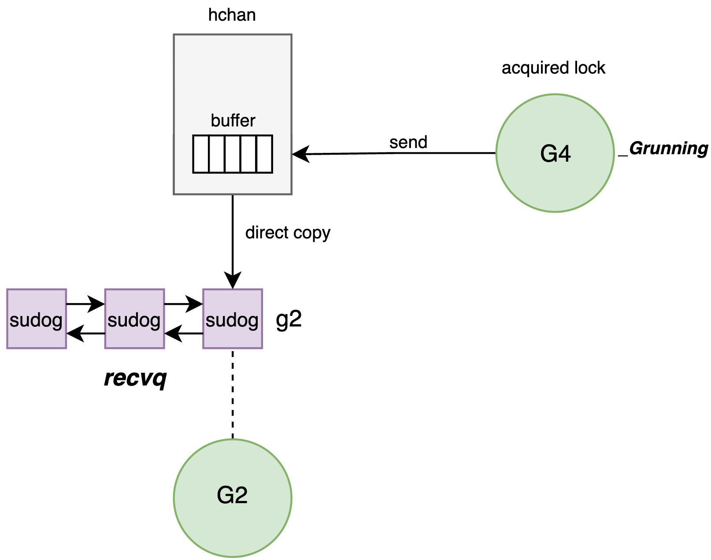
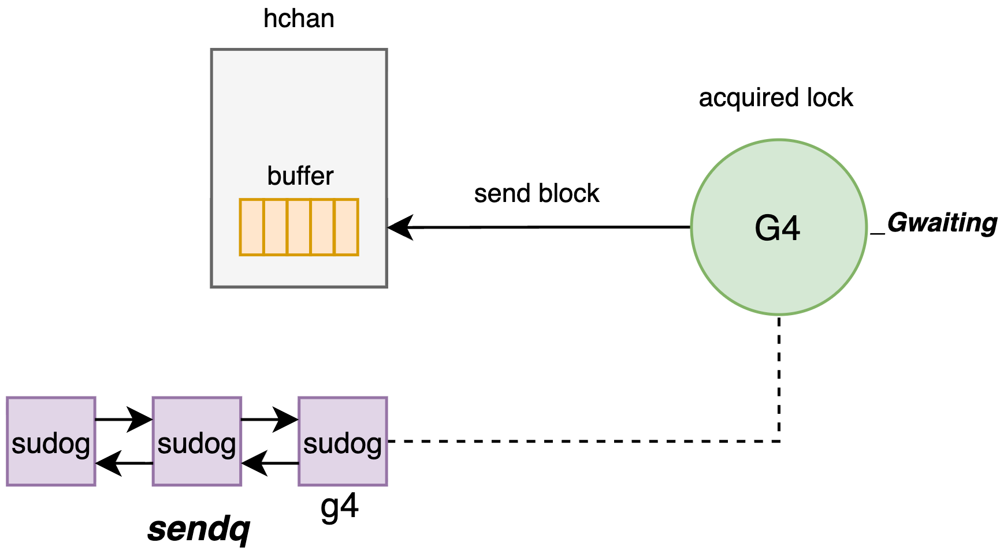

# 12. 并发同步--channel & select

## 1. 概述

Go 语言的并发模型基于 CSP 理论，其核心设计哲学为“通过通信来共享内存，而非通过共享内存来通信”。`channel` 是该哲学的具体实现载体。它不仅仅是一个数据传输管道，更是 `runtime` 层面实现 `goroutine` 间同步与协作的核心原语。
`select` 是 Go 提供的 `channel` 操作多路选择语句：在多个 send/recv 分支中选择一个当前可立即执行的分支；若都不可执行，则按需阻塞，并支持 `default`（非阻塞）与超时/取消（通常通过 timer/channel 或 context 组合实现）。

---

## 2. channel 的核心数据结构：`hchan`

`channel` 在 `runtime` 内部由 `hchan` 结构体表示（源码位于 `runtime/chan.go`）。它是一个在堆上分配的复杂对象，集成了数据存储、锁机制与等待队列。

```go
type hchan struct {  
    qcount   uint           // 当前环形队列中的元素数量  
    dataqsiz uint           // 环形队列的总容量 (make(chan, N) 中的 N)    
    buf      unsafe.Pointer // 指向底层环形队列数组的指针  
    elemsize uint16         // 元素大小 (字节)  
    closed   uint32         // channel 是否已关闭 (0: open, 1: closed)  
    elemtype *_type         // 元素类型元数据  
    sendx    uint           // 发送索引 (环形队列尾指针)  
    recvx    uint           // 接收索引 (环形队列头指针)  
    recvq    waitq          // 接收等待队列 (双向链表, 存储阻塞的 G)  
    sendq    waitq          // 发送等待队列 (双向链表, 存储阻塞的 G)  
    lock     mutex          // 互斥锁，保护 hchan 所有字段的原子性  
}
```

结合源码的内容，我们通过图1来描述hchan的核心组件。

*图1: hchan内部结构*

1. **环形缓冲区**：
    
    - 对于有缓冲 `channel` (`dataqsiz > 0`)，`buf` 指向一块连续内存，作为环形队列使用。
    - `runtime` 维护 `sendx` 和 `recvx` 两个索引，分别指示下一次写入和读取的位置，利用模运算实现环状复用。
    - 该设计避免了频繁的内存分配与回收，实现了 O(1) 复杂度的存取操作。
    
2. **等待队列**：
    
    - `recvq` 和 `sendq` 是两个双向链表，用于存储因 `channel` 满或空而阻塞的 `goroutine`。
    - 链表节点为 `sudog` 结构体，它封装了 `goroutine`、相关的数据指针以及同步信号量。`sudog` 是 `goroutine` 与 `channel` 之间的中介对象。
    
3. **互斥锁 lock**：`channel` **并非无锁设计**。所有的发送 (`ch <- val`)、接收 (`<- ch`) 和关闭 (`close`) 操作在修改 `hchan` 状态前必须获取该锁。

---

## 3. channel 发送与接收的底层流转

`channel` 的发送与接收逻辑是一个高度优化的状态机，`runtime` 根据 `channel` 的缓冲区状态和等待队列状态，执行不同的路径。图2展示了`goroutine`对`channel`操作的底层表现。

*图2: goroutine对channel操作的底层表现*

### 3.1 发送流程

当执行 `ch <- val` 时

- **直接发送**：
    
    - **条件**：`recvq` 不为空
    - **操作**：`runtime` 不会将数据存入 Buffer，而是直接将数据从当前 G 的栈内存拷贝到目标等待 G 的栈内存中，完全绕过缓冲区，减少了一次内存拷贝，且直接唤醒接收者，延迟较低。


*图3: 直接发送数据*

- **缓冲发送**：
    
    - **条件**：`recvq` 为空，且 Buffer 未满。
    - **操作**：获取锁，将数据拷贝到 `buf[sendx]` 位置，`sendx` 自增（模运算），`qcount` 自增，释放锁。
    - **状态**：发送方 G 继续执行，不阻塞。

*图4: 缓冲发送数据*

- **阻塞发送**：
    
    - **条件**：Buffer 已满（或无缓冲且无接收者）。
    - **操作**：
        
        1. 获取 `hchan.lock`。
        2. 构造 `sudog` 结构，将其挂入 `sendq` 等待队列的队尾。
        3. 调用 `gopark` 挂起当前 G，释放锁。
        4. 上下文切换：当前线程 M 转去执行其他 G。
        
    - **恢复**：当有接收者取走数据后，会主动唤醒 `sendq` 中的 G。

*图5: 阻塞发送数据*

### 3.2 接收流程

当执行 `val := <- ch` 时

1. **直接接收**：
    
    - **条件**：`sendq` 不为空
    - **操作**：原理同直接发送，都是直接进行了copy，延迟较低。
      
2. **缓冲接收**：
    
    - **条件**：`sendq` 为空，Buffer 不为空。
    - **操作**：接收者从 `buf[recvx]` 拷贝数据，更新索引，释放锁。
    
3. **阻塞接收**：
    
    - **条件**：Buffer 为空，且 `sendq` 为空。
    - **操作**：构造 `sudog` 挂入 `recvq`，调用 `gopark` 挂起。

### 3.3 Channel 的关闭机制

详细见`/runtime/chan.go/closechan(c *hchan)`，当执行 `close(ch)` 时，`runtime` 会执行以下严格步骤：

1. **前置检查**：
    
    - **Nil Panic**：如果 `channel` 为 `nil`，直接 Panic（`panic: close of nil channel`）。
    
    - **Repeated Close Panic**：如果 `hchan.closed` 已经是 1，说明重复关闭，直接 Panic（`panic: close of closed channel`）。
    - 见源码的判断逻辑：

```go
  if c == nil {  
	panic(plainError("close of nil channel"))  
  }  
		  
	lock(&c.lock)  
  if c.closed != 0 {  
	unlock(&c.lock)  
	panic(plainError("close of closed channel"))  
  }
```

2. **加锁**：
    
    - 获取 `hchan.lock`。关闭操作必须是原子的，防止在关闭过程中有新的数据写入或读取。
    
3. **状态变更**：
    
    - 设置 `hchan.closed = 1`。从此以后，该 `channel` 进入“只读”模式。
    
4. **清退等待队列**： 这是 `close` 最核心的动作。`runtime` 必须遍历并唤醒所有被阻塞的 `goroutine`，但对读和写的处理截然不同：
    
    - **清退接收者 (`recvq`)**：
        
        - 遍历 `recvq` 链表。
        - 对于每一个阻塞的接收者 G，`runtime` 会将其原本等待接收数据内存位置（`sudog.elem`）被写入该类型的**零值**。
        - 同时设置 `sudog.success = false`（这对应了用户代码 `val, ok := <-ch` 中的 `ok` 为 `false`）。
        - 将该 G 加入到“待唤醒列表” (`glist`)。
        
    - **清退发送者 (`sendq`)**：
        
        - **高危动作**：如果此时竟然还有 G 在 `sendq` 里排队（说明之前 Buffer 满了，它们在等空位），这意味着它们试图向一个已关闭的 Channel 发送数据。`runtime` 会将这些 G 也加入“待唤醒列表”。当这些发送者 G 被唤醒后，它们会在自己的代码路径中检测到 `channel` 已关闭，从而触发 **Panic**（`panic: send on closed channel`）。

```go
	  if c.closed != 0 {  
		unlock(&c.lock)  
		panic(plainError("send on closed channel"))  
	}
```

   - **调度唤醒**：
    
     - 释放 `hchan.lock`。
     - 遍历“待唤醒列表”，逐个调用 `goready(g)`，将这些 G 重新投入 GMP 调度队列。

这也是为什么我们不能去重复close(ch)或向处于被关闭状态的`channel`做send操作，这些操作都会触发panic。

>其实我们可以想一下假如类似的操作不panic会有什么问题，针对重复关闭channel这个操作，意味着当前channel的操作存在竞态，这本身是一个设计缺陷并且可能导致严重的数据问题，所以go在设计上直接避免发生这种情况或者让这种情况的问题尽早暴露出来。

---
## 4. select 多路复用

`select` 语句允许 `goroutine` 同时等待多个 `channel` 操作。其底层实现（`runtime/select.go`）包含复杂的随机化与锁排序机制，以避免死锁和饥饿。

### 4.1 核心逻辑流程

-  **随机序**：
    
    - select 并非按源码顺序轮询 `channel`，而是通过 `fastrand()` 生成一个随机排列的索引数组 `pollorder`。
    - **目的**：防止因固定轮询顺序导致的“饥饿现象”（即排在前面的 `channel` 总是被优先处理）。
    
- **锁排序**：
    
    - select 需要同时获取所有涉及 `channel` 的锁。为防止死锁（Deadlock），`runtime` 将所有 `channel` 的内存地址进行排序，生成 `lockorder`。
    - **规则**：严格按照地址顺序获取锁，遵循“资源有序分配”原则。

  图3展示了假如select不按照channel的内存排序进而陷入死锁的问题。
  
*图6: select dead lock*

我们列举一个实际场景并结合图3的内容来说一下为什么会出现死锁：

- **协程 G1**：执行 `select { case <-ch1: ...; case <-ch2: ... }`
- **协程 G2**：执行 `select { case <-ch2: ...; case <-ch1: ... }`

**T1 时刻**：

- G1 按照代码顺序，成功抢到了 `ch1` 的锁。
- G2 按照代码顺序，成功抢到了 `ch2` 的锁。

**T2 时刻**：

- G1 试图去抢 `ch2` 锁（为了完成它的 select 检查），但 `ch2` 被 G2 拿着-> **G1 阻塞等待 G2**。
- G2 试图去抢 `ch1` 的锁，但 `ch1` 被 G1 拿着-> **G2 阻塞等待 G1**。

**结果**：
- G1 等 G2，G2 等 G1。形成死结，程序卡死。

所以，select严格按照channel的内存地址进行排序，这样可以防止因为读取顺序而导致的死锁问题。

- **全量阻塞**：
    
    - 若所有 channel 均未就绪：
        
        1. 将当前 G 包装成 `sudog`。
        2. 将该 `sudog` **同时**挂入所有涉及 channel 的等待队列 (`recvq` 或 `sendq`)。
        3. 调用 `gopark` 挂起当前 G。
        
    - **唤醒机制**：当任意一个 channel 变为就绪状态时，会唤醒该 G。G 被唤醒后，必须从**所有**其他 channel 的等待队列中移除自己的 `sudog`，以确保不会被重复唤醒。

---
## 5. 总结

channel 的高性能与安全性源于其精密的底层设计：

- **数据结构**：`hchan` 利用环形队列实现了高效的数据存取，利用**sudog双向链表**管理阻塞的 goroutine。
- **排序逻辑**：在并发场景下，通过**互斥锁** 将并行的竞争转化为串行的入队操作，保证了严格的 **FIFO** 时序。
- **优化机制**：**Direct Send/Recv**机制通过直接内存拷贝绕过缓冲区，大幅减少了内存复制开销。
- **select 机制**：通过**随机轮询**解决饥饿问题，通过**地址排序锁**解决死锁问题，实现了安全高效的多路复用。