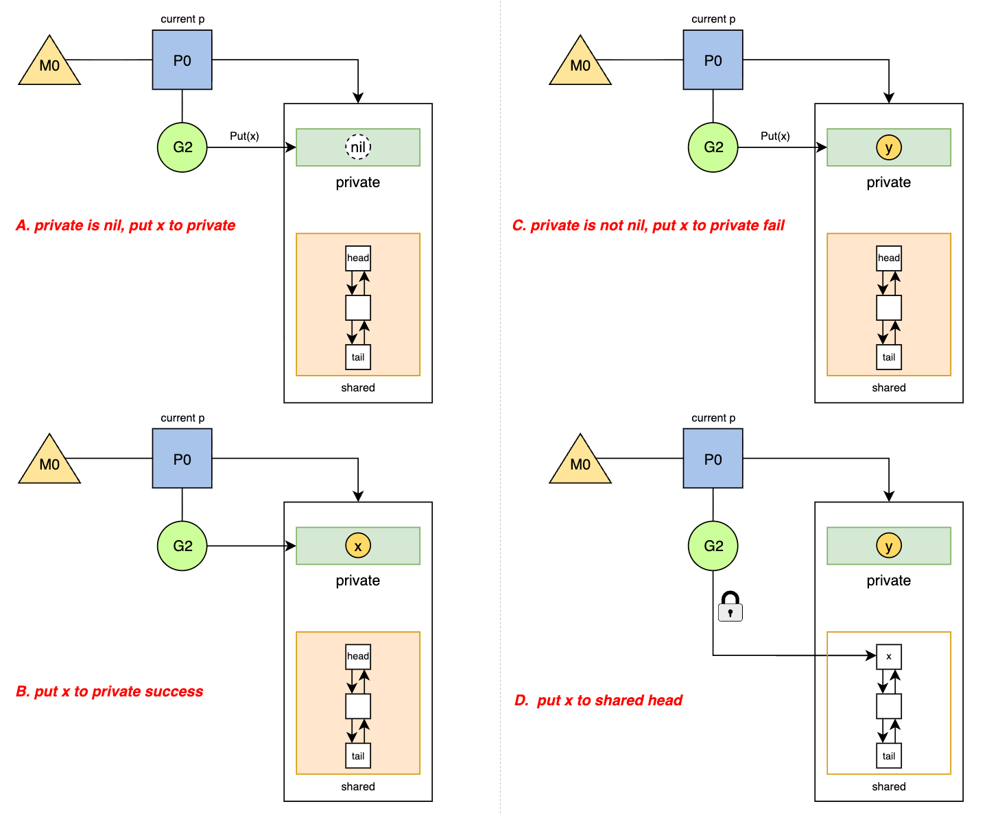
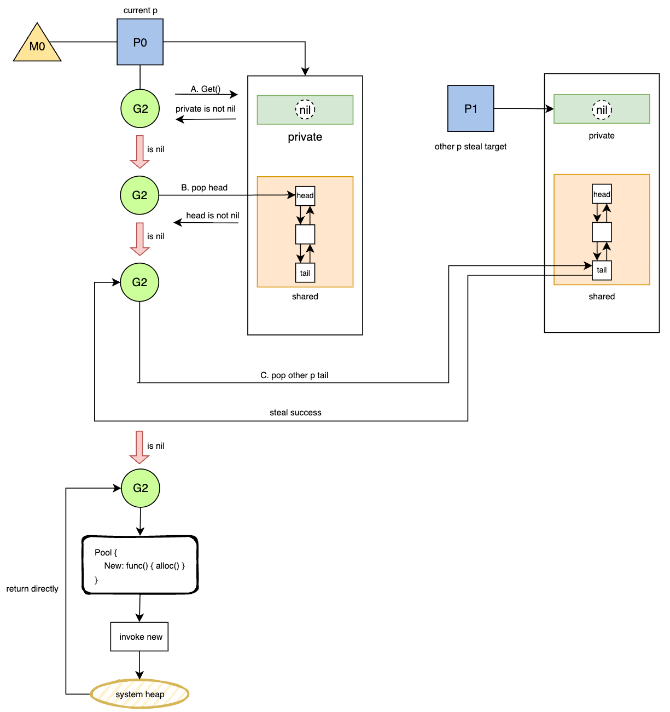

# 14. sync.Pool

!!! abstract "Abstract" 
	**Keywords**: _Object Pool, GMP模型, P-Local, Victim Cache, Work Stealing, 无锁队列_

## 1. 概述

Go 语言的 `sync.Pool` 提供了一种机制，允许保存一组临时对象以便单独保存和复用。其核心设计目标是**减轻垃圾回收（GC）的压力**，通过复用内存来减少高频分配带来的 CPU 开销和内存碎片。

与 `mutex` 试图解决并发竞争不同，`sync.Pool` 利用 Go 调度器（GMP 模型）的特性，采用 **P-Local** 的存储策略，尽可能在无锁状态下完成对象的存取，仅在跨 P 窃取时才引入轻量级的同步机制。

## 2. 核心数据结构与内存布局

`sync.Pool` 的源码实现（位于 `src/sync/pool.go`）展示了其如何利用 CPU 缓存局部性来优化性能。

### 2.1 结构体定义

`sync.Pool` 结构体对外暴露的 API 非常简单，但其底层通过 `poolLocal` 数组实现了与 P 的绑定。

```go
type Pool struct {
    noCopy noCopy

    local     unsafe.Pointer // 指向 [P]poolLocal 数组的指针
    localSize uintptr    // 数组大小，通常等于 P 的数量 (GOMAXPROCS)

    // 用户自定义的对象创建函数，当池为空时调用
    New func() any 
}

// 对应每个 P 的本地存储结构
type poolLocal struct {
    poolLocalInternal
    // 防止伪共享
    pad [128 - unsafe.Sizeof(poolLocalInternal{})%128]byte 
}

// 内部核心存储
type poolLocalInternal struct {
    private any       // 私有对象，只能由当前的 P 存取，无锁操作
    shared  poolChain 
}
```

### 2.2 内存布局解析

`sync.Pool` 的核心在于 `local` 字段，它是一个指向 `poolLocal` 数组的指针。数组的索引直接对应当前 goroutine 所在的 P 的 ID。

- **Private 区 (无锁)**: 每个 `poolLocal` 包含一个 `private` 字段。当 G 在 P 上运行时，优先存取该字段。因为同一时刻一个 P 只能运行一个 G，所以此处操作**完全无锁**，速度极快（Fast Path）。
- **Shared 区 (有锁/CAS)**: 当 `private` 为空或已满时，操作会转移到 `shared` 字段。这是一个双端队列，支持当前 P 从队头 Push/Pop，以及其他 P 从队尾 Steal（Pop）。
- **False Sharing 优化**: 结构体中的 `pad` 字段强制将 `poolLocal` 对齐到 CPU 缓存行，避免不同 P 在修改各自的 `poolLocal` 时导致缓存行失效。

图1描述了`sync.Pool`的内部结构及同P的关联示意图。

*图1: sync.Pool结构示意图*

---

## 3. Get 与 Put 流程深度剖析

`sync.Pool` 的操作同样采用了 Fast Path 和 Slow Path 分离的设计策略，以适应不同的竞争场景。

### 3.1 Put 流程 (归还对象)

put的流程如图2所示，我们以用户调用 `Put(x)` 为例进行描述。

*图2: put流程示意*

当进行put操作时，`runtime` 首先会禁止当前 G 的抢占（Pin P），然后按以下优先级存储：

1. **Fast Path**: 如果当前 P 的 `private` 为 `nil`，直接将对象填入 `private`。操作结束，耗时极短。
2. **Slow Path**: 如果 `private` 已经有值，则将对象 put 到 `shared` 队列的头部（head）。
3. **解锁**: 解除 P 的 Pin 状态。

这里需要特别注意的是，在进行put操作之前，会执行`pin()`操作来避免 goroutine 在访问 P-local 的过程中被调度到另一个 P，导致错误的 local 访问与竞态。

### 3.2 Get 流程 (获取对象)

`Get()` 的逻辑相对复杂，涉及本地缓存读取和跨 P 窃取（Work Stealing）。图3展示了详细的决策逻辑及流程示意。

*图3: get流程示意*

get的流程是经过多个决策的，主要步骤如下：

- 从当前g绑定的p的`private`字段获取，假如不为空，直接返回；
- 从当前g绑定的p的`shared`列表获取，假如head不为空，直接返回；
- 假设当前p的`private`和`shared`都为空，那么其会尝试从其他p的`shared`列表窃取，窃取成功则直接返回；
	- 窃取者总是从 `shared` 队列的**尾部**取数据；
	- 当前 p 总是从 `shared` 队列的**头部**取数据；
	- 这种 Head/Tail 分离的机制使得在大部分情况下，本地 p 和窃取者互不干扰，仅当队列中只剩下一个元素时才需要通过 CAS 进行竞争。
	
- 上述的操作都没有成功，那么就会调用new方法来申请一块新的内存空间；

---

## 4. GC 清理与 Victim Cache

`sync.Pool` 的一个关键特性是它对垃圾回收的敏感性。对象并不是永久存储的，而是通过 **Victim Cache（受害者缓存）** 机制延长生命周期。

### 4.1 存活周期

1. **GC 开始**: Runtime 调用 `poolCleanup` 函数。
2. **数据迁移**:
    
    - 当前所有的 `oldPools` (上一轮 GC 幸存者) 被彻底清除（置为 nil）。
    - 当前所有的 `allPools` (活跃对象) 被移动到 `oldPools` 中，成为 Victim Cache。
    - `allPools` 被重置为空。
    
3. **GC 结束**: 程序继续运行。

### 4.2 性能影响

这种机制意味着：

- 放入 Pool 的对象**最多存活两次 GC 间隔**。
- 在 GC 刚结束后，`Get` 操作的命中率会短暂下降，因为主要缓存被移到了 Victim 区。
- 随着程序运行，热点对象会从 Victim 区（通过 `Get`）被捞回并重新 `Put` 到活跃区，或者通过 `New` 重新创建。

## 5. gin中的应用

由于我们目前的服务中使用`gin`作为http模块的处理的框架，所以有必要针对`sync.Pool`在`gin`中的应用做下梳理。`gin` 被称为高性能 Web 框架，其核心优化手段之一就是利用 `sync.Pool` 来复用 `*gin.Context` 对象。在 Web 服务中，Context 对象承载了请求详情、响应写入器、中间件链等信息，是一个体积较大且生命周期短暂（仅存活于一次 HTTP 请求期间）的对象。

如果没有对象池，对于 QPS 为 10万的服务，意味着每秒钟需要在堆上频繁申请和销毁 10万个 `Context` 对象。这会造成两个严重后果：

- **GC 压力剧增**：大量临时对象导致 GC 频繁触发，STW 时间变长，增加长尾延迟。
- **CPU 浪费**：频繁的 `malloc` 和 `free` 系统调用消耗大量 CPU 资源。

### 5.1 gin的实现方案

`gin` 在 `Engine` 结构体中初始化了一个 `sync.Pool`：

```go
// gin.go
type Engine struct {  
    RouterGroup
	// ...
	pool   sync.Pool // 对象池
}    

func New() *Engine {
    engine := &Engine{
        // ... 其他初始化
    }
    // 初始化 pool，指定 New 函数
    engine.pool.New = func() any {
        return engine.allocateContext()
    }
    return engine
}
```

在处理每一个 HTTP 请求时，Gin 严格遵循了 `Get -> Reset -> Use -> Put` 的生命周期：

```go
// gin.go 中的 ServeHTTP 方法
func (engine *Engine) ServeHTTP(w http.ResponseWriter, req *http.Request) {
    // 1. Get: 从池中获取一个 Context 对象
    // 此时获取到的对象可能包含上一次请求的残留数据
    c := engine.pool.Get().(*Context)
    
    // 2. Reset: 重置 
    // 将 ResponseWriter 和 Request 替换为当前请求的 
    // 同时重置内部的 Keys、Errors、Handlers 链等  
    c.writermem.reset(w) 
    c.Request = req 
    c.reset()
	
	// 3. Use: 处理业务逻辑 
	engine.handleHTTPRequest(c)
	
	// 4. Put: 归还对象 
	// 请求处理完毕，将对象放回池中，等待下一次复用  
    engine.pool.Put(c)
```
## 5. 总结

### 5.1 使用上需要注意的问题

- **不可存储连接**: 不要用它来存储数据库连接或 Socket，因为对象会被 GC 悄悄回收。
- **必须 Reset**: 取出的对象可能包含脏数据，务必在 `Get` 后或 `Put` 前重置对象状态。

```go
// 最佳实践示例
var bufPool = sync.Pool{
	New: func() any {
	   return new(bytes.Buffer)
	},
}

func Log(w io.Writer, key, val string) {
	b := bufPool.Get().(*bytes.Buffer)
		b.Reset() // 必须重置！
		// ... 业务逻辑
	bufPool.Put(b)
}
```

### 5.2 总结

Go 的 `sync.Pool` 展示了在多核环境下对内存管理的极致优化：

- **P-Local 架构**: 通过将数据分片到每个 P，消除了大部分锁竞争，实现了极高的吞吐量。
- **Victim Cache**: 巧妙地利用两级缓存机制，既避免了无限制的内存增长，又防止了 GC 导致的缓存雪崩。
