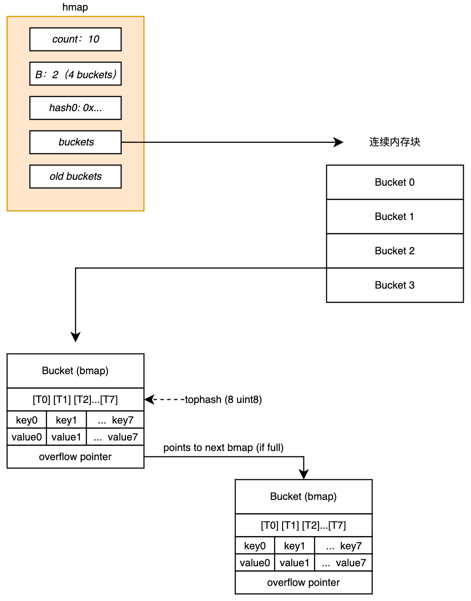
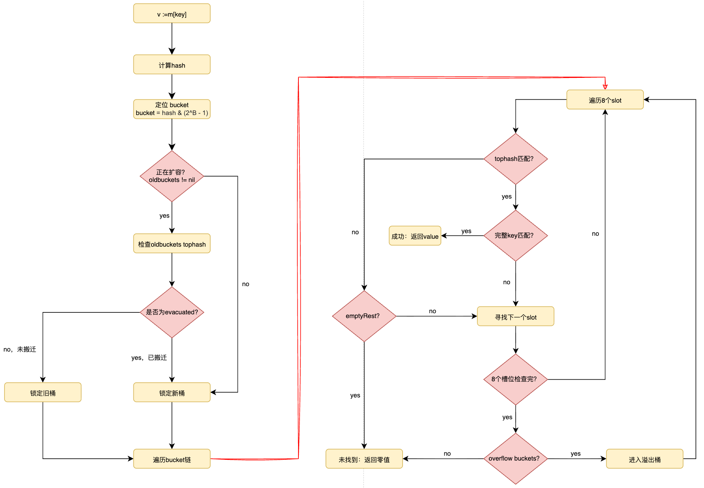

# 15. map

## 1. 引言

map 在编程语言中是非常常见的一种数据结构，其提供了**平均 O(1)** 的查询效率（最坏情况下会退化为 O(N)），但不同语言有不同的设计和实现。在 Go 语言中，map 作为内建类型，深度嵌入编译器和 runtime，编译阶段会将 map 操作（如 `m[key]`、`delete(m, key)`）直接替换为 runtime 包中特定的函数调用。

这种与 runtime 的深度绑定，带来了很多优势：

- **编译期特化与类型安全**：编译器根据 key/value 的类型自动选择不同的 runtime 函数（如 `mapaccess1_fast32`、`mapaccess1_faststr`）。
- **GC、内存分配与 map 的扩缩容机制深度协作**：不仅仅是 map，很多其他组件的设计也都结合了这些特性。

我们将从源码开始，结合平时在开发中常用 map 的一些操作来梳理内容。

## 2. 核心结构

### 2.1 hmap

Go map 在运行时的核心表示是 `runtime.hmap` 结构体。以下是其关键字段:

```go
type hmap struct {  
    count      int            // 当前元素数量, len(m) 直接读此字段  
    flags      uint8          // 并发读写检测标志位  
    B          uint8          // bucket 数量 = 2^B    
    noverflow  uint16         // overflow bucket 的近似数量  
    hash0      uint32         // hash 种子, 创建时随机生成  
    buckets    unsafe.Pointer // 指向 []bmap 数组, 大小 2^B
    oldbuckets unsafe.Pointer // 扩容时指向旧 bucket 数组  
    nevacuate  uintptr        // 扩容进度计数器  
    extra      *mapextra      // overflow bucket 和其他辅助信息  
}
```

`buckets` 指针指向连续内存块的**起始位置**，即指向第 0 个 bucket。每个 bucket 在 `runtime` 中都由 `bmap` 结构体来表示，`bmap`的代码定义如下：

```go
type bmap struct { 
  tophash [bucketCnt]uint8 
}
```

这是一个静态的代码定义，在实际的运行中，编译器会根据你在代码中定义的具体类型（如`map[int64]string`）动态的扩充这个结构体，扩充后在内存中实际的结构体内容如下：

```go
type bmap struct { 
  tophash [8]uint8   // 源码里定义的 
  keys [8]keyType    // 编译器自动追加的 
  values [8]elemType // 编译器自动追加的 
  overflow uintptr   // 编译器自动追加的
}
```

所以，`hmap.buckets` 指向的那个地址，既是 tophash 数组的起始地址，也是这整个bmap的起始地址，图1描述了`hmap`和`bmap`之间的关系：


*图1: hamp和bmap结构示意*

### 2.2 bmap

`bmap` 除了在编译阶段会展开外，其展开后的 tophash 以及 key/value 的字段布局都是经过精心设计的：

- **tophash快速过滤**: 查找时先比对 hash 值的高 8 位（tophash），8 个 tophash 连续存储在同一 cache line 中，CPU 一次加载就能完成初筛，减少无效的完整 key 比较。
- **key/value分离存储**：所有 key 连续排列，所有 value 连续排列（而非 key0-val0-key1-val1），这是为了减少内存对齐的 padding 浪费。

tophash 的设计意味着即便发生哈希冲突，在大多数情况下只需比对 1 字节的 tophash 就能排除不匹配的 key，而无需做代价高昂的完整 key 比较。这是 Go map 在高负载下仍能保持较好性能的关键原因之一，以下为 tophash 关键数值的说明：

| 值    | 宏常量名             | 含义与运行时行为                                                                    | 核心作用                                      |
| ---- | ---------------- | --------------------------------------------------------------------------- | ----------------------------------------- |
| 0    | `emptyRest`      | 空槽位，且后续全空。<br>表示当前槽位为空，并且在这个 Bucket 的后续槽位（以及后续挂载的溢出桶）中，没有任何有效数据。            | 性能优化的关键：查找过程遇到此标记时，立即终止遍历，无需继续向后扫描。       |
| 1    | `emptyOne`       | 空槽位，但后续可能有数据。<br>表示当前槽位为空（通常是因为原来的 Key 被 `delete` 删除了），但后续的槽位或溢出桶中可能还有有效数据。 | 维持链条连续性：查找过程遇到此标记时，不能停止，必须跳过当前槽位继续向后查找。   |
| 2    | `evacuatedX`     | 已搬迁-低位区。<br>表示在扩容过程中，该槽位的数据已经被迁移到了新 Bucket 数组的**前半部分**（对应旧的 Bucket 索引）。     | 扩容并发安全： 标记旧Bucket 的数据去向，防止在搬迁过程中丢失读写操作。   |
| 3    | `evacuatedY`     | 已搬迁-高位区。<br>表示在扩容过程中，该槽位的数据已经被迁移到了新 Bucket 数组的**后半部分**（对应 `旧索引 + 2^OldB`）。  | 扩容并发安全:同上，区分扩容后的新位置（X还是Y取决于哈希值的下一位是0还是1）。 |
| 4    | `evacuatedEmpty` | 已搬迁-原为空。<br>表示在扩容扫描时，发现该槽位本来就是空的（`emptyOne` 或`emptyRest`），现已标记为“搬迁处理完毕”。    | 扩容元数据：明确标识该槽位已被处理过，避免重复扫描。                |
| >= 5 | `minTopHash`     | 有效数据。<br>表示存储的是 Key 哈希值的高 8 位（如果计算结果小于 5，会自动 +5 偏移）。                        | 快速过滤：用于快速比对 Key 是否可能匹配。                   |

## 3. 核心操作

### 3.1 创建

当我们使用 `make(map[K]V)` 或 `make(map[K]V, hint)` 创建 map 时，编译器会根据 hint 的大小选择不同的 runtime 函数：

- **hint <= 8（小 map）**：编译器调用 `makemap_small`，此时不会立即分配 bucket 数组，而是在第一次写入时才分配。这是一个重要的优化——很多 map 在创建后可能只存放很少的元素，延迟分配避免了不必要的内存开销。
- **hint > 8**：编译器调用 `makemap`，根据 hint 计算出合适的 B 值（满足负载因子约束），并立即分配 `2^B` 个 bucket。当 B ≥ 4 时，还会额外预分配约 `2^(B-4)` 个溢出桶（详见 4.1 节）。

如果你能预估 map 的大小，在 `make` 时传入合理的 hint 值可以显著减少运行时的扩容次数。例如，`make(map[string]int, 1000)` 会一次性分配足够容纳 1000 个元素的空间，避免多次渐进式扩容带来的额外开销。
### 3.2 查找

当编译器遇到 `v := m[key]` 时，会生成对`runtime.mapaccess1`的调用（返回 value 指针），或`runtime.mapaccess2`（返回 value 指针和 bool）。查找流程如下：

1. 计算 hash：使用 `hmap.hash0` 作为种子，调用类型特定的 hash 函数。对于小类型（int32/int64/string），编译器会直接内联 hash 计算以避免函数调用开销。
2. 定位 bucket：`bucket_index = hash & (2^B - 1)`，即 hash 的低 B 位。
3. 扩容中的双重检查：如果 `oldbuckets != nil`（说明正在扩容），需要额外检查旧 bucket 中对应位置的数据。因为扩容是渐进式的，目标 key 可能尚未从旧桶迁移到新桶。通过 `hash & (2^(B-1) - 1)` 定位旧桶位置后，检查其 tophash 标记：如果已标记为 `evacuatedX`/`evacuatedY`，说明数据已迁移到新桶，回到新桶继续查找；如果未迁移，则直接在旧桶中查找。
4. 匹配 tophash：计算`tophash = hash >> (PtrSize*8 - 8)`（其中 `PtrSize` 是指针大小，64 位系统上为 8 字节，所以实际上是取 hash 的最高 8 位），在 bucket 的 tophash 数组中线性扫描匹配。
5. 比较完整 key：tophash 匹配后，比较完整 key 值。对于 string key，先比长度再比内容。
6. 遍历 overflow：当前 bucket 未找到，沿 overflow 链继续搜索。如果遍历过程中遇到 `emptyRest` 标记，立即终止，无需继续查找。

查找过程的流程图如图2所示：


*图2: map查找流程图*

理解查找流程后可以明白，为什么 Go map 在扩容期间不会出现"读取不到已存在key"的问题——runtime 会同时检查新旧两个桶，保证数据一致性。

### 3.3 写入

写入流程比查找更复杂一些，因为涉及扩容判定和内存分配：

1. 并发写检测：检查 `flags` 的 `hashWriting` 位，若已设置则直接 `fatal（"concurrent map writes"）`。然后设置 hashWriting 位。
2. 触发扩容判定：写入前检查是否需要扩容（详见3.5节）。
3. 查找插入位置：沿 bucket 和 overflow 链查找已有 key 或第一个空位。
4. 分配 overflow：如果所有位置都满，分配新的 overflow bucket。
5. 写入并更新 count：将 key/value 写入对应位置，设置 tophash 并做 count++。
6. 清除写标记：操作完成后清除`hashWriting`位。

写入过程的流程图如图3所示：


*图3: map写入流程图*

### 3.4 删除

删除操作找到目标 key 后，会将 tophash 设置为`emptyOne`（值为 1），并清零 key 和 value 的内存（帮助 GC 回收引用的对象）。之后会向前回溯，将连续的`emptyOne`转化为`emptyRest`，以优化后续查找。

需要注意的是，删除不会缩减 bucket 数组的大小--map 只扩不缩，已分配的内存在 map 生命周期内不会归还。这一特性对内存管理有重要影响（详见4.3节）。

删除过程的流程图如图4所示：


*图4: map删除流程图*

`emptyOne` → `emptyRest` 的回溯升级是一个容易被忽略的优化细节。它确保了删除操作不会让后续查找变慢--如果一个 bucket 尾部的若干元素都被删除了，查找到这些位置时可以立即终止，而不需要继续遍历整条 overflow 链。
### 3.5 扩容机制

Go map 的设计在性能与内存之间做了精细的权衡。为了保证哈希表的查找效率（尽量维持平均 $O(1)$ 时间复杂度）并解决内存碎片问题，runtime 定义了两种不同的扩容触发条件，分别对应翻倍扩容和等量扩容两种策略。

#### 3.5.1 翻倍扩容

翻倍扩容是最常见的扩容方式，为了解决数据过多导致哈希冲突严重的问题。当 $\frac{\text{count}}{2^B} > 6.5$ 时，会触发翻倍扩容。其中`count`时 map 中的元素数量，`2^B`是桶的数量，6.5 即负载因子阈值。

当buckets中的元素过多时，哈希冲突的概率急剧增加，大量 key 会被挤在同一个 bucket 或挂在 overflow bucket 上，这会导致平均O(1)退化为O(N)。扩容策略如下：

- **新建 buckets**：runtime 会分配一个新的 buckets 数组，其容量是旧buckets 的2倍（`B = B + 1`）;
- **数据重分布**：旧数据会被重新分配到新的、更大的 buckets 空间中，从而降低哈希冲突，恢复查找性能。

翻倍扩容时，旧 bucket 中的每个元素根据 hash 值新增的那一位（第 B位），被分流到新数组的两个 bucket 中（X=原位 或 Y=原位+旧容量），这就是 `evacuatedX`/`evacuatedY` 两个 tophash 标记的含义（见2.2小节中的表信息）。

#### 3.5.2 等量扩容

等量扩容不增加 buckets 的数量，而是为了解决内存碎片和伪内存泄漏问题。由于 overflow buckets 数量过多，具体阈值取决于 B 的大小:

- 当 $B < 15$ 时：overflow buckets 数量 $\ge 2^B$。
- 当 $B \ge 15$ 时：overflow buckets 数量 $\ge 2^{15}$。

这种情况通常发生在频繁插入后又频繁删除的场景。虽然 map 中的元素总数（count）减少了，负载因子可能并不高，但之前分配的大量 overflow buckets 依然存在且大量槽位是空的（tophash 为 `emptyOne`）。这导致查找变慢（需要遍历很长的 overflow 链表，尽管里面大多是空位）和空间浪费（大量未被释放的空 bucket 占用了内存）。

等量扩容的策略如下：

- **新建 buckets**：runtime 分配一个新的 buckets 数组，容量与旧 buckets 保持一致（B 不变）。
- **内存整理**：将旧 buckets 中的有效元素紧凑地搬迁到新 buckets 中。
- 效果：搬迁后，overflow buckets 的数量会大幅减少，原本松散的数据被排列得更紧密，从而提高了 CPU 缓存命中率并回收了多余的内存空间。

如果你的程序存在"大量写入 → 大量删除 → 少量存活"的模式（如临时缓存场景），即使 map 中只剩少量元素，底层的 overflow 链仍可能很长。此时 runtime 的等量扩容会自动整理内存布局，但这个整理操作本身也有开销，需要在设计上尽量避免这种访问模式。

#### 3.5.3 渐进式迁移

无论上述何种扩容策略，runtime 都采用渐进式迁移的策略：扩容不会一次性完成所有数据迁移，而是在每次 `mapassign` 和 `mapdelete` 操作时迁移 1~2 个旧 bucket（调用 `growWork`），直到所有旧 bucket 迁移完毕。这种设计将扩容的 O(N) 开销分摊到后续的写操作中，避免了单次操作的延迟尖峰。

### 3.6 迭代

当我们使用 `for k, v := range m` 遍历 map 时，编译器会将其转化为对 `runtime.mapiterinit` 和 `runtime.mapiternext` 的调用。迭代的核心机制如下：

**随机起始位置**：`mapiterinit` 会随机选择一个起始 bucket 和起始 slot 作为遍历的起点。这就是为什么每次 `range map` 的顺序都不同-- Go 故意在语言层面引入随机性，防止开发者依赖 map 的遍历顺序（这个顺序在不同 Go 版本、不同运行环境下都可能变化）。

**扩容中的迭代处理**：如果迭代过程中 map 正在扩容，迭代器需要同时处理新旧两个 bucket 数组。对于每个逻辑上的 bucket 位置，迭代器会检查旧桶是否已迁移：如果已迁移，直接访问新桶；如果未迁移，从旧桶中读取数据，但只返回属于当前新桶位置的元素（通过检查 hash 值来判断）。

所以我们需要注意，在 `range` 遍历过程中对 map 做删除操作是安全的（runtime 不会 panic），但新增操作可能触发扩容导致 bucket 迁移，使得新增的 key 在本次遍历中不一定能被访问到。因此应避免在 `range` 中新增元素。如果确实需要边遍历边修改，建议先收集需要修改的 key，遍历结束后再统一操作。

## 4. 同内存管理与 GC 交互

### 4.1 按需分配和逃逸分析

当我们使用 `make(map[k]v, hint)` 创建 map 时，runtime 会根据 hint 的大小和编译期的逃逸分析结果，决定内存分配的位置和方式。

小容量map在栈上分配：`hmap` 结构体和底层的 bucket 数组会直接在栈上分配。这种分配方式完全避开了堆内存分配器，无需垃圾回收（GC）介入，函数返回时自动释放，性能极高。

当 hint 较大或 map 发生逃逸时，runtime 必须在堆上申请内存。此时，`hmap.buckets` 指向的是一块通过 `mallocgc` 分配的连续内存区域。对于较大的 `hint`（计算出 $B \ge 4$），`runtime`会额外采取**预分配策略**：

- 它不仅分配 $2^B$ 个标准桶，还会额外分配约 $2^{B-4}$ 个**溢出桶**，这些溢出桶在物理内存上紧跟在标准桶数组的末尾。
- 当发生哈希冲突需要使用溢出桶时，可以直接从这段连续内存中获取，避免了频繁调用 `mallocgc` 产生的系统开销，同时提升了 CPU 缓存命中率。

图5描述了预分配的流程：

*图5: map预分配机制*

除了根据 map 容量大小进行内存分配策略外，如果 key 或 value 的大小超过 128 字节，也会采取不同的策略：bucket 内部将不再直接存储数据本身，而是存储指向数据的指针，实际数据会被分配在堆上。这是为了避免单个 bucket 过大，导致扫描和扩容时的拷贝开销不可控。

### 4.2 hmap.extra 与 GC 优化

Go 的垃圾回收器在扫描内存时，会遍历所有包含指针的对象。如果 map 极大，GC 扫描 bucket 链表会带来巨大的性能损耗。

对此 Go 做了一个关键优化——如果 map 的 key 和 value 都不包含指针（例如 `map[int]int`），runtime 会将整个 buckets 数组标记为 `no-scan`。但这带来一个问题：bucket 结构体中包含一个 overflow 指针，如果不扫描，GC 会误回收溢出桶。

runtime 使用 `hmap.extra.overflow` 字段（见 2.1 节的 hmap 结构体）接管所有溢出桶的指针。GC 只需要扫描 `hmap.extra` 即可知道哪些溢出桶是存活的，从而跳过对巨大的 buckets 数组的逐个扫描。

对于大规模 map，如果 key 和 value 都是非指针类型（如 `map[int64]int64`），GC 的扫描开销会显著降低。如果你的 map 存储了大量元素且对 GC 延迟敏感，尽量避免 value 中包含指针类型（string 底层也包含指针）。一个常见的优化技巧是将 `map[int]*BigStruct` 改为将数据存储在 slice 中，map 只存储 index：`map[int]int32`。

### 4.3 只扩不缩

Go map 的 bucket 数组一旦扩容就不会缩小。这意味着如果你先向 map 写入 100 万个元素再全部删除，底层 bucket 数组仍然保持 100 万元素级别的大小。这在以下场景中会造成内存浪费：

- **缓存场景**：定期清理过期数据后，map 占用的内存不会下降。
- **流量峰值**：高峰期 map 扩容后，低峰期内存不会回收。

解决方案是定期重建 map（创建新 map 并迁移存活数据）或使用带 TTL 的 map 库。具体示例见 6.1.4 节。

## 5. 并发

### 5.1 读写操作

Go map 没有内置锁，但在运行时层面实现了并发读写检测。其机制是：

- 写操作设置标志：`mapassign` 和 `mapdelete`在进入时设置 `hmap.flags` 的 `hashWriting` 位(值为 4）。
- 所有操作检查标志：`mapaccess`、`mapassign`、`mapdelete`、`mapiterinit` 在进入时都会检查 `hashWriting` 位。
- 检测到并发直接 fatal：不是 panic，而是 fatal——不可被 recover 捕获。程序直接崩溃并打印 `concurrent map read and map write` 或 `concurrent map writes`。

需要特别强调：这是一个尽力检测，不是线程安全保障。两个 goroutine 同时写 map 完全可能在没有触发检测的情况下导致内存损坏、无限循环等未定义行为。

### 5.2 sync.Map

`sync.Map` 是 Go 标准库提供的并发安全 map，但它并非 map + mutex 的简单封装。其核心设计是读写分离:

- read表：原子指针指向一个只读的 map（无需加锁即可访问），覆盖最近被读取的key。
- dirty表：加锁保护的 map，包含所有最新数据。新 key 只写入dirty 表。
- 提升机制：当read表miss次数（`misses`）超过dirty表大小时，dirty表整体提升为新的read表。

`sync.Map`的数据结构定义如下：

```go
type Map struct {
	_      noCopy
	mu     Mutex
	read   atomic.Pointer[readOnly]
	dirty  map[any]*entry
	misses int
}
```

从上述的核心设计和数据结构中，`sync.Map` 的读是接近无锁访问的，但是新 key 的写入需要加锁往 dirty 结构中写入。假如当前的场景中，读操作远多于写操作，或者说 key 比较固定，那么使用 `sync.Map` 可以带来非常高的性能提升；但是，假如存在频繁增删 key（读操作 miss 次数增多），就会造成 dirty 表反复创建和提升，锁竞争严重，性能反而不如 `RWMutex + map` 的方式。

下面的表给出了在不同场景中两者间的主要区别：

| **维度** | **map + RWMutex** | **sync.Map**   | **实现原理**                                         |
| ------ | ----------------- | -------------- | ------------------------------------------------ |
| 读性能    | 良好（受限于 RLock 竞争）  | 极高 (接近 $O(1)$) | read 采用 `atomic.LoadPointer`，无锁，无 CPU 缓存失效。      |
| 写性能    | 良好（受限于互斥锁）        | 极差             | 写新 key 需加 Mutex，且可能触发全量数据从 read 复制到 dirty 的极重操作。 |
| 修改已有值  | 良好                | 极高             | 若 key 已在 read 中，通过底层 CAS 直接修改指针，无锁。              |
| 内存占用   | 较小（单一份数据）         | 较大（可能翻倍）       | `sync.Map` 经常需要同时维护 read 和 dirty 两份映射表。          |

在实际的开发应用中，根据实际场景进行选择对系统稳定性和性能的影响还是很大的。比较稳妥的做法是使用 `RWMutex + map` 的组合来解决问题，因为其平衡性比较好，不会出现大的问题；但如果面对特定场景，例如某些配置项缓存、静态路由等读多写极少的场景，选择 `sync.Map` 性能更高。

## 6. 总结

### 6.1 常见的坑

Go map是在实际开发中非常常用的一种数据结构，但是由于其底层实现上的复杂性，所以在使用过程中需要特别注意。

#### 6.1.1 向nil map写操作

这个问题在刚开始接触 Go 的时候经常犯，见如下代码：

```go
// 1. 声明map，未初始化
var m map[string]int

// OK, 返回 0
_ = m["a"]

// panic: assignment to entry in nil map
m["a"] = 1
```

nil map 的 `hmap` 指针为 nil，`mapaccess` 对 nil 做了处理（直接返回零值），但 `mapassign` 在解引用 `hmap` 字段时会触发空指针异常。解决方案是始终使用 `make(map[K]V) `或字面量 `map[K]V{}` 初始化。

#### 6.1.2 遍历中修改map

这里只讨论单协程修改 map 的场景。前文中（第 3.5 节）对 map 的扩容做过详细讨论，当 map 在增加操作下可能触发扩容导致 bucket 的迁移，一旦 bucket 发生迁移，那么在边查边增的逻辑下就会导致当前 key 在本次遍历中无法被命中。所以要避免 range 行为中新增的操作。

```go
// 可能导致新增的 key 在本次 range 中不可见
for k, v := range m {  
    if someCondition(k, v) {  
       m[newKey] = newValue // 可能触发扩容，导致不确定行为  
    }  
}  
  
// 先收集，后修改  
var toAdd []struct{ k, v int }  
for k, v := range m {  
    if someCondition(k, v) {  
       toAdd = append(toAdd, struct{ k, v int }{ newKey, newValue})  
    }  
}  
for _, item := range toAdd {  
    m[item.k] = item.v  
}
```

#### 6.1.3 key的选择

Go map 中规定，key 值必须是可以比较的（`==` 或 `!=`），这种规定的核心原因是，map 底层的 key 值是通过 hash 运算并且在 hash 冲突时必须进行比较确定 key 的具体值才能命中实际的槽位。

除了 key 可比较外，不同类型的 key 的性能表现差距很大。我们应尽量选择 int 或 string 为 key，因为编译器会为这些类型生成特化的 hash 和比较函数（如 `mapaccess1_fast64`、`mapaccess1_faststr`），比较时效率较高。应避免使用数组、struct 或 interface 为 key--它们需要走通用的 hash 和比较路径，开销更大。
#### 6.1.4 内存泄漏

由于 map 只扩不缩的特性（见 4.3 节），以下场景容易导致内存泄漏：

**缓存未设上限**：不断向 map 添加缓存条目但从不淘汰。应设置最大容量并实现 LRU 等淘汰策略。

```go
// 不推荐：无限增长的缓存  
var cache = make(map[string]Data)  
  
func Set(key string, val Data) {  
    cache[key] = val // 只增不减，内存持续增长  
}  
  
// 推荐：定期重建 mapfunc RebuildCache() {  
    newCache := make(map[string]Data, len(activeKeys))  
    for _, key := range activeKeys {  
       if val, ok := cache[key]; ok {  
          newCache[key] = val  
       }  
    }  
    cache = newCache // 旧 map 被 GC 回收，释放多余的 bucket 内存  
}
```

**goroutine 局部 map 泄漏**：goroutine 中创建的 map 因 goroutine 泄漏而无法释放。这本质上是 goroutine 泄漏问题，但 map 的只扩不缩特性会放大内存占用。

```go
// 如果 ch 永远没有数据，goroutine 和其中的 map 都无法被 GC 回收  
go func() {  
    localMap := make(map[string]int)  
    for item := range ch { // ch 永远阻塞 → goroutine 泄漏  
       localMap[item.Key] = item.Value  
    }  
}()
```

**高峰流量后的内存驻留**：高峰期 map 扩容到很大，低峰期即使删除了大量元素，底层内存也不会释放。解决方案同样是定期重建 map，或在架构层面使用带 TTL 和容量限制的缓存库。

### 6.2 总结

Go 语言中的 map 并非一个简单的哈希表数据结构，在剖析其底层源码与运行机制后，我们对 map 的主要特性做下总结：

- **内存与性能**：为了更好的利用 CPU 缓存和内存对齐，`bmap` 摒弃了常规的 `key/value` 交替存储，采用键值分离的紧凑布局；为了降低大容量 map 的 GC 扫描成本，引入了 `mapextra` 机制。
- **低延迟**：无论是翻倍扩容还是等量整理，没有采用 Stop-The-World 的一次性搬迁，而是采取了渐进式迁移的策略，将 $O(N)$ 的扩容成本平摊到每一次读写操作中。
- **并发安全**：放弃了原生的线程安全控制，仅提供尽力而为的并发读写检测（fatal 机制）。这是一个有意的设计取舍，为不需要并发安全的场景（绝大多数场景）避免了锁开销。
- **只增不减**：明确 delete 只切断业务数据引用而不释放 bucket 底层数组，所以我们不能滥用 map ，而要在特定的场景采取不同的策略。