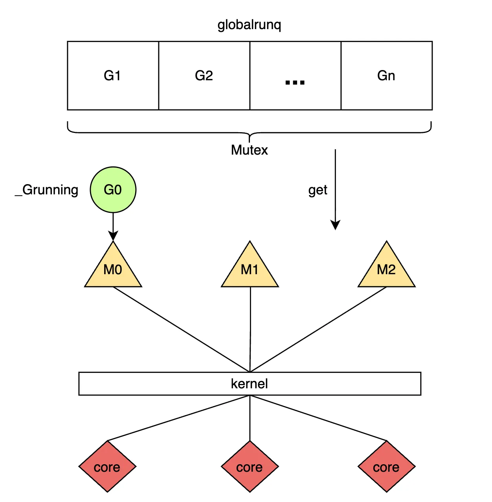
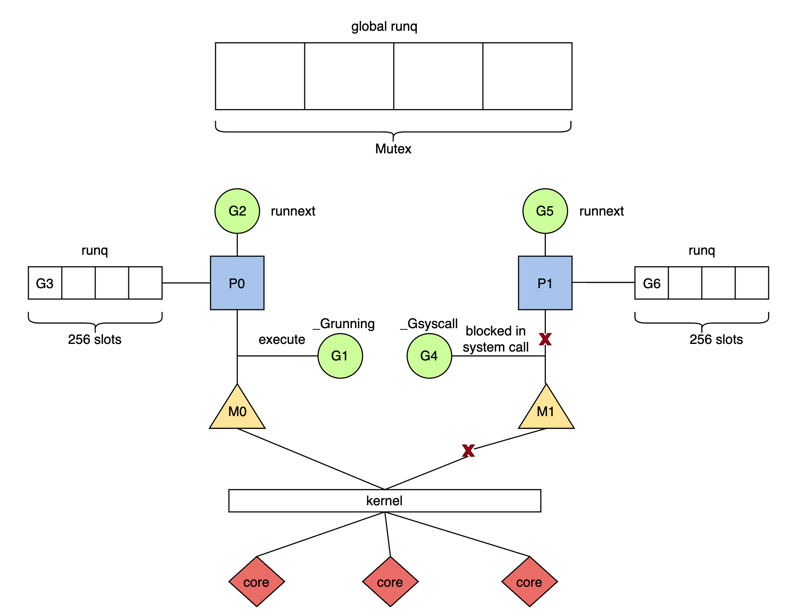

#  GMP 模型

> gemini3 辅助本文档的编写和校准工作，图片使用draw.io绘制

## 1. 背景与痛点

Go 引入 Goroutine 的核心动力是为了解决 C10K 问题。传统的并发模型往往依赖于操作系统内核线程（OS Thread），但这种 1:1 的模型在高并发场景下面临显著的瓶颈：

* **内存开销大：** 线程栈通常固定在 1MB-8MB，若创建 10,000 个线程，内存占用将达到 GB 级别。
* **上下文切换慢：** 线程调度由内核完成，涉及用户态与内核态的切换，开销通常在微秒级。
* **调度语义鸿沟：** 内核调度器无法感知特定编程语言层面的语义（如 IO 密集型还是计算密集型），难以做出针对性优化。

为了解决上述问题，Go 设计了用户态线程——Goroutine：

* **动态栈管理：** 初始栈仅为 2KB，并支持动态伸缩，单进程可轻松支撑数百万 Goroutine。
* **廉价上下文切换：** 切换完全在用户态进行，只需保存 PC、SP、DX 等少量寄存器，成本低至纳秒级。
* **同步编程，异步执行：** 配合 Runtime 的 Netpoller，开发者可以使用同步阻塞的编程风格，底层自动转化为非阻塞异步 I/O，大幅降低心智负担。

---

## 2. 调度器架构演进

### 2.1 早期架构：GM 模型 (Go 1.0)

Go 1.0 采用朴素的 M:N 调度模型，称为 GM 模型。它主要包含两个实体：

* **G (Goroutine)：** 并发任务单元。
* **M (Machine)：** 操作系统内核线程，执行实体。

**核心缺陷：**
所有的 G 都维护在一个**单一的全局运行队列 (Global Run Queue)** 中。M 获取任务必须竞争一把全局锁（Mutex）。随着 CPU 核心数增加，锁竞争极其激烈，导致性能急剧下降。

*图 1: GM 模型架构及其全局锁瓶颈*

### 2.2 当前架构：GMP 模型 (Go 1.1+)

Dmitry Vyukov 引入了第三个实体 **P (Processor)**，重构了调度链路。

* **P (Processor)：** 逻辑处理器，代表执行 Go 代码所需的资源上下文（Context）。

**GMP 模型实体关系：**

* **M 必须绑定 P** 才能执行 G。
* **P 拥有本地队列**，实现了无锁访问。

*图 2: GMP 模型架构：本地队列与 Syscall 分离机制*

**P 的引入解决了两大核心问题：**

1. **消除全局锁瓶颈：** 每个 P 维护一个**本地运行队列 (Local Run Queue)**。M 优先消费本地队列，无需加锁，大幅提升了并行度。
2. **资源解耦与复用：** P 持有 mcache 等内存资源。当 M 因系统调用（Syscall）阻塞时，P 会与 M 分离（Handoff），携带资源寻找新的 M 继续执行其他 G，避免了计算资源的浪费。

---

## 3. 核心调度机制

GMP 的核心不仅在于结构变化，更在于一套复杂的调度算法，旨在实现**高吞吐、低延迟与公平性**的平衡。

### 3.1 调度循环 (Schedule Loop)

M 在持有 P 的情况下，通过 `findrunnable` 函数执行调度循环。根据最新的 Runtime 逻辑，查找 G 的优先级顺序如下（结合图 3）：

1. **Check Global Queue (Periodic)：** 为了防止全局队列饥饿，每 **61** 次调度循环，强制优先检查一次全局队列。
2. **Check `runnext`：** 检查 P 的高优先级单槽位（亲缘性调度）。
3. **Check Local Run Queue：** 检查 P 的本地队列（无锁，最快路径）。
4. **Check Global Queue (Fallback)：** 如果本地为空，常规检查全局队列。
5. **Check Network Poller：** 检查是否有 I/O 就绪的 G。
6. **Work Stealing：** 尝试从其他 P 的本地队列窃取任务。

*图 3: Go 调度器核心状态流转与优先级检查流程*

### 3.2 关键调度策略

#### 3.2.1 局部性优化：runnext

这是一种“插队”机制。当 G1 唤醒 G2 时（如 Channel 通信），G2 会被直接放入 G1 所在 P 的 `runnext` 槽位。

* **收益：** 继承了时间片，极大提升了 L1/L2 Cache 的命中率，适合 Pipeline 模式。
* **代价：** 破坏了 FIFO 公平性，可能导致老任务饥饿（通过 61 次全局检查机制兜底）。

#### 3.2.2 负载均衡：工作窃取 (Work Stealing)

为了解决分布式队列导致的“忙闲不均”问题，当 P 本地无任务时，会主动窃取其他 P 本地队列**后半部分**的任务。

* **设计哲学：** 在局部性（Locality）与 CPU 利用率之间，优先保证 CPU 不空转。空转的代价远高于 Cache Miss。

#### 3.2.3 饥饿预防：61 次强制检查

调度器每经过 61 次循环（`schedtick`），会强制访问全局队列。

* **目的：** 打破 `runnext` 和本地队列的垄断，保证全局队列中的 G 最终能被执行。
* **溢出兜底：** 全局队列还充当了溢出缓冲区，当 P 本地队列满（256 slots）时，部分 G 会被批量转移至全局队列。

#### 3.2.4 抢占机制 (Preemption)

为了防止死循环或长时间运行的 G 占用 M，Sysmon 监控线程会发起抢占（阈值均为 10ms）：

1. **协作式抢占：** 编译器在函数入口插入检查指令（stack guard）。当 G 调用函数时触发栈扩张逻辑，从而主动让出 CPU。
2. **异步抢占 (Go 1.14+)：** 针对没有函数调用的密集计算循环，Sysmon 发送 `SIGURG` 信号，通过信号处理函数强行中断并保存上下文。

#### 3.2.5 极致性能：自旋与 Netpoller

* **Netpoller 非阻塞：** 当 G 进行网络 I/O 时，G 进入 Netpoller 等待，**M 不会阻塞**，而是立即执行下一个 G。
* **自旋线程 (Spinning Thread)：** 为了降低 M 唤醒的系统调用开销，闲置的 M 不会立即休眠，而是自旋（消耗少量 CPU）积极寻找任务。这是用 CPU 换取低延迟的典型权衡。

---

## 4. 总结

GMP 模型是 Go 高并发能力的基石。它通过 **Runnext** 极致利用局部性，通过 **Work Stealing** 保证负载均衡，通过 **Preemption** 确保调度公平，并利用 **Syscall Handoff** 和 **Netpoller** 实现了对操作系统线程的高效复用。
## 5. 进一步了解
[Goroutine 深度解析](goroutine.md)